# RISC-V Reference SoC Tapeout Program

**Author:** Shwetank Shekhar  
**Program:** RISC-V Reference SoC Tapeout Program, IIT Gandhinagar & VSD(VLSI System Design)  
**GitHub:** [ShekharShwetank](https://github.com/ShekharShwetank)  

---

## Table of Contents

1. [Program Overview](#program-overview)
2. [VSDBabySoC Architecture](#vsdbabysoc-architecture)
3. [Complete Design Flow](#complete-design-flow)
   - [Tool Installation](#tool-installation-and-setup)
   - [RTL Design & Synthesis](#rtl-design-and-synthesis)
   - [Functional Modeling](#functional-modeling-and-simulation)
   - [Post-Synthesis STA](#post-synthesis-static-timing-analysis)
   - [Transistor-Level Analysis](#transistor-level-spice-analysis)
   - [OpenROAD Floorplan & Placement](#openroad-flow-setup-and-placement)
   - [OpenLANE Physical Design](#openlane-physical-design-labs)
   - [Complete Physical Design Flow](#complete-physical-design-rtl-to-gdsii)
   - [Multi-Corner STA Analysis](#multi-corner-multi-stage-sta-analysis)
4. [Key Contributions and Unique Experiments](#key-contributions-and-unique-experiments)
5. [Final Results and Metrics](#final-results-and-metrics)
6. [Conclusion](#conclusion)
7. [References and Acknowledgments](#references-and-acknowledgments)

## Directory Structure

```bash
ank@shwetank-shekhar:~/Desktop/SoC_Shwetank/Documents/IIT$ tree
.
├── assets
│   ├── chip_stats.png
│   ├── Clock_tree_vsdbabysoc.png
│   ├── COMPLETE_ORFS_SUCCESFUL_vsdbabysoc.png
│   ├── complete_orfs_vsdbabysoc.png
│   ├── comp_pre_vs_post_synth_sim_2.png
│   ├── comp_pre_vs_post_synth_sim.png
│   ├── congestion_resolved_fully.png
│   ├── critical_path_improved.png
│   ├── critical_path.png
│   ├── critical_path_with_lib_delays.png
│   ├── cts_vsdbabysoc.png
│   ├── docker_TAG.png
│   ├── extracted_timing_across_all_corners.png
│   ├── Floorplan_main.png
│   ├── floorplan_vsdbabysoc.png
│   ├── Floorplan_zoom.png
│   ├── Installation_Summary.png
│   ├── KLayout_spm.gds_1.png
│   ├── make_final_base_summary.png
│   ├── OpenROAD_6_final-gcd.png
│   ├── OpenROAD_verification_succesful_run.png
│   ├── OpenROAD_version.png
│   ├── PCTS.png
│   ├── placement_vsdbaysoc.png
│   ├── PP.png
│   ├── PR.png
│   ├── PS.png
│   ├── PVT_SUMMARY_ACROSS_ALL_CORNERS.png
│   ├── pvt_summary.png
│   ├── PVT_SUM_VERIFY.png
│   ├── pvt_tns.png
│   ├── pvt_wns.png
│   ├── pvt_worst_hold.png
│   ├── pvt_worst_setup.png
│   ├── reports.png
│   ├── results.png
│   ├── routed_vsdbabysoc.png
│   ├── spm.gds_full.png
│   ├── spm.gds_zoom.png
│   ├── successful_OpenROAD_installation.png
│   ├── vsdbabysoc.yosys_show.png
│   ├── waveform_post_synth_sim.png
│   ├── waveform_pre_synth_sim_2.png
│   ├── waveform_pre_synth_sim.png
│   └── Yosys_version.png
├── flow
│   ├── debug_pdn.tcl
│   ├── designs
│   │   └── sky130hd
│   │       └── VSDBabySoC
│   │           ├── check_power.tcl
│   │           ├── config.mk
│   │           ├── gds
│   │           │   ├── avsddac.gds
│   │           │   └── avsdpll.gds
│   │           ├── gls_model
│   │           │   ├── primitives.v
│   │           │   └── sky130_fd_sc_hd.v
│   │           ├── include
│   │           │   ├── sandpiper_gen.vh
│   │           │   ├── sandpiper.vh
│   │           │   ├── sp_default.vh
│   │           │   └── sp_verilog.vh
│   │           ├── layout_conf
│   │           │   ├── rvmyth
│   │           │   │   ├── config.tcl
│   │           │   │   └── pin_order.cfg
│   │           │   └── vsdbabysoc
│   │           │       ├── config.tcl
│   │           │       ├── macro.cfg
│   │           │       └── pin_order.cfg
│   │           ├── lef
│   │           │   ├── avsddac.lef
│   │           │   └── avsdpll.lef
│   │           ├── lib
│   │           │   ├── avsddac.lib
│   │           │   ├── avsdpll.lib
│   │           │   ├── sed_outputs
│   │           │   └── sky130_fd_sc_hd__tt_025C_1v80.lib
│   │           ├── list_macros.out
│   │           ├── list_macros.tcl
│   │           ├── macro.cfg
│   │           ├── pdn_custom.tcl
│   │           ├── pin_order.cfg
│   │           ├── run_log.md
│   │           ├── run_sta_all_corners.tcl
│   │           ├── script
│   │           │   ├── sta.conf
│   │           │   ├── verilog_to_lib.pl
│   │           │   └── yosys.ys
│   │           ├── sdc
│   │           │   ├── vsdbabysoc_layout.sdc
│   │           │   └── vsdbabysoc_synthesis.sdc
│   │           ├── src
│   │           │   └── module
│   │           │       ├── avsddac.v
│   │           │       ├── avsdpll.v
│   │           │       ├── clk_gate.v
│   │           │       ├── pseudo_rand_gen.sv
│   │           │       ├── pseudo_rand.sv
│   │           │       ├── rvmyth_gen.v
│   │           │       ├── rvmyth.tlv
│   │           │       ├── rvmyth.v
│   │           │       ├── testbench.rvmyth.post-routing.v
│   │           │       ├── testbench.v
│   │           │       └── vsdbabysoc.v
│   │           ├── vsdbabysoc_layout.sdc
│   │           └── vsdbabysoc_synthesis.sdc
│   ├── extract_timing_metrics.py
│   ├── generate_heatmap_table.py
│   ├── logs
│   │   ├── sky130hd
│   │   │   └── VSDBabySoC
│   │   │       └── base
│   │   │           ├── 1_1_yosys_canonicalize.log
│   │   │           ├── 1_2_yosys.log
│   │   │           ├── 2_1_floorplan.json
│   │   │           ├── 2_1_floorplan.log
│   │   │           ├── 2_2_floorplan_macro.json
│   │   │           ├── 2_2_floorplan_macro.log
│   │   │           ├── 2_3_floorplan_tapcell.json
│   │   │           ├── 2_3_floorplan_tapcell.log
│   │   │           ├── 2_4_floorplan_pdn.json
│   │   │           ├── 2_4_floorplan_pdn.log
│   │   │           ├── 3_1_place_gp_skip_io.json
│   │   │           ├── 3_1_place_gp_skip_io.log
│   │   │           ├── 3_2_place_iop.json
│   │   │           ├── 3_2_place_iop.log
│   │   │           ├── 3_3_place_gp.json
│   │   │           ├── 3_3_place_gp.log
│   │   │           ├── 3_4_place_resized.json
│   │   │           ├── 3_4_place_resized.log
│   │   │           ├── 3_5_place_dp.json
│   │   │           ├── 3_5_place_dp.log
│   │   │           ├── 4_1_cts.json
│   │   │           ├── 4_1_cts.log
│   │   │           ├── 5_1_grt.json
│   │   │           ├── 5_1_grt.log
│   │   │           ├── 5_2_route.json
│   │   │           ├── 5_2_route.log
│   │   │           ├── 5_3_fillcell.json
│   │   │           ├── 5_3_fillcell.log
│   │   │           ├── 6_1_fill.json
│   │   │           ├── 6_1_fill.log
│   │   │           ├── 6_1_merge.log
│   │   │           ├── 6_report.json
│   │   │           └── 6_report.log
│   │   ├── sta_all_corners.log
│   │   └── sta_corners
│   │       ├── postcts_ff_100C_1v65.log
│   │       ├── postcts_ff_100C_1v95.log
│   │       ├── postcts_ff_n40C_1v56.log
│   │       ├── postcts_ff_n40C_1v65.log
│   │       ├── postcts_ff_n40C_1v76.log
│   │       ├── postcts_ff_n40C_1v95.log
│   │       ├── postcts_ss_100C_1v40.log
│   │       ├── postcts_ss_100C_1v60.log
│   │       ├── postcts_ss_n40C_1v28.log
│   │       ├── postcts_ss_n40C_1v35.log
│   │       ├── postcts_ss_n40C_1v40.log
│   │       ├── postcts_ss_n40C_1v44.log
│   │       ├── postcts_ss_n40C_1v60.log
│   │       ├── postcts_ss_n40C_1v76.log
│   │       ├── postcts_tt_025C_1v80.log
│   │       ├── postcts_tt_100C_1v80.log
│   │       ├── postplace_ff_100C_1v65.log
│   │       ├── postplace_ff_100C_1v95.log
│   │       ├── postplace_ff_n40C_1v56.log
│   │       ├── postplace_ff_n40C_1v65.log
│   │       ├── postplace_ff_n40C_1v76.log
│   │       ├── postplace_ff_n40C_1v95.log
│   │       ├── postplace_ss_100C_1v40.log
│   │       ├── postplace_ss_100C_1v60.log
│   │       ├── postplace_ss_n40C_1v28.log
│   │       ├── postplace_ss_n40C_1v35.log
│   │       ├── postplace_ss_n40C_1v40.log
│   │       ├── postplace_ss_n40C_1v44.log
│   │       ├── postplace_ss_n40C_1v60.log
│   │       ├── postplace_ss_n40C_1v76.log
│   │       ├── postplace_tt_025C_1v80.log
│   │       ├── postplace_tt_100C_1v80.log
│   │       ├── postroute_ff_100C_1v65.log
│   │       ├── postroute_ff_100C_1v95.log
│   │       ├── postroute_ff_n40C_1v56.log
│   │       ├── postroute_ff_n40C_1v65.log
│   │       ├── postroute_ff_n40C_1v76.log
│   │       ├── postroute_ff_n40C_1v95.log
│   │       ├── postroute_ss_100C_1v40.log
│   │       ├── postroute_ss_100C_1v60.log
│   │       ├── postroute_ss_n40C_1v28.log
│   │       ├── postroute_ss_n40C_1v35.log
│   │       ├── postroute_ss_n40C_1v40.log
│   │       ├── postroute_ss_n40C_1v44.log
│   │       ├── postroute_ss_n40C_1v60.log
│   │       ├── postroute_ss_n40C_1v76.log
│   │       ├── postroute_tt_025C_1v80.log
│   │       ├── postroute_tt_100C_1v80.log
│   │       ├── postsynth_ff_100C_1v65.log
│   │       ├── postsynth_ff_100C_1v95.log
│   │       ├── postsynth_ff_n40C_1v56.log
│   │       ├── postsynth_ff_n40C_1v65.log
│   │       ├── postsynth_ff_n40C_1v76.log
│   │       ├── postsynth_ff_n40C_1v95.log
│   │       ├── postsynth_ss_100C_1v40.log
│   │       ├── postsynth_ss_100C_1v60.log
│   │       ├── postsynth_ss_n40C_1v28.log
│   │       ├── postsynth_ss_n40C_1v35.log
│   │       ├── postsynth_ss_n40C_1v40.log
│   │       ├── postsynth_ss_n40C_1v44.log
│   │       ├── postsynth_ss_n40C_1v60.log
│   │       ├── postsynth_ss_n40C_1v76.log
│   │       ├── postsynth_tt_025C_1v80.log
│   │       └── postsynth_tt_100C_1v80.log
│   ├── plot_timing_graphs.py
│   ├── reports
│   │   ├── sky130hd
│   │   │   └── VSDBabySoC
│   │   │       └── base
│   │   │           ├── 2_floorplan_final.rpt
│   │   │           ├── 3_detailed_place.rpt
│   │   │           ├── 3_global_place.rpt
│   │   │           ├── 3_resizer.rpt
│   │   │           ├── 4_cts_final.rpt
│   │   │           ├── 5_detailed_route.rpt
│   │   │           ├── 5_global_route.rpt
│   │   │           ├── 5_route_drc.rpt
│   │   │           ├── 5_route_drc.rpt-10.rpt
│   │   │           ├── 5_route_drc.rpt-15.rpt
│   │   │           ├── 5_route_drc.rpt-20.rpt
│   │   │           ├── 5_route_drc.rpt-25.rpt
│   │   │           ├── 5_route_drc.rpt-30.rpt
│   │   │           ├── 5_route_drc.rpt-35.rpt
│   │   │           ├── 5_route_drc.rpt-40.rpt
│   │   │           ├── 5_route_drc.rpt-45.rpt
│   │   │           ├── 5_route_drc.rpt-50.rpt
│   │   │           ├── 5_route_drc.rpt-55.rpt
│   │   │           ├── 5_route_drc.rpt-5.rpt
│   │   │           ├── 5_route_drc.rpt-60.rpt
│   │   │           ├── drt_antennas.log
│   │   │           ├── grt_antennas.log
│   │   │           ├── synth_check.txt
│   │   │           ├── synth_stat.txt
│   │   │           └── VDD.rpt
│   │   └── sta_across_pvt
│   │       ├── graphs
│   │       │   ├── heatmap_table_postcts.png
│   │       │   ├── heatmap_table_postplace.png
│   │       │   ├── heatmap_table_postroute.png
│   │       │   ├── heatmap_table_postsynth.png
│   │       │   ├── hold_slack_heatmap.png
│   │       │   ├── setup_slack_comparison.png
│   │       │   ├── setup_slack_heatmap.png
│   │       │   ├── ths_comparison.png
│   │       │   ├── tns_comparison.png
│   │       │   ├── tns_heatmap.png
│   │       │   ├── violations_by_corner_type.png
│   │       │   ├── whs_comparison.png
│   │       │   └── wns_comparison.png
│   │       ├── postcts_ff_100C_1v65_hold.rpt
│   │       ├── postcts_ff_100C_1v65_setup.rpt
│   │       ├── postcts_ff_100C_1v65_summary.txt
│   │       ├── postcts_ff_100C_1v95_hold.rpt
│   │       ├── postcts_ff_100C_1v95_setup.rpt
│   │       ├── postcts_ff_100C_1v95_summary.txt
│   │       ├── postcts_ff_n40C_1v56_hold.rpt
│   │       ├── postcts_ff_n40C_1v56_setup.rpt
│   │       ├── postcts_ff_n40C_1v56_summary.txt
│   │       ├── postcts_ff_n40C_1v65_hold.rpt
│   │       ├── postcts_ff_n40C_1v65_setup.rpt
│   │       ├── postcts_ff_n40C_1v65_summary.txt
│   │       ├── postcts_ff_n40C_1v76_hold.rpt
│   │       ├── postcts_ff_n40C_1v76_setup.rpt
│   │       ├── postcts_ff_n40C_1v76_summary.txt
│   │       ├── postcts_ff_n40C_1v95_hold.rpt
│   │       ├── postcts_ff_n40C_1v95_setup.rpt
│   │       ├── postcts_ff_n40C_1v95_summary.txt
│   │       ├── postcts_ss_100C_1v40_hold.rpt
│   │       ├── postcts_ss_100C_1v40_setup.rpt
│   │       ├── postcts_ss_100C_1v40_summary.txt
│   │       ├── postcts_ss_100C_1v60_hold.rpt
│   │       ├── postcts_ss_100C_1v60_setup.rpt
│   │       ├── postcts_ss_100C_1v60_summary.txt
│   │       ├── postcts_ss_n40C_1v28_hold.rpt
│   │       ├── postcts_ss_n40C_1v28_setup.rpt
│   │       ├── postcts_ss_n40C_1v28_summary.txt
│   │       ├── postcts_ss_n40C_1v35_hold.rpt
│   │       ├── postcts_ss_n40C_1v35_setup.rpt
│   │       ├── postcts_ss_n40C_1v35_summary.txt
│   │       ├── postcts_ss_n40C_1v40_hold.rpt
│   │       ├── postcts_ss_n40C_1v40_setup.rpt
│   │       ├── postcts_ss_n40C_1v40_summary.txt
│   │       ├── postcts_ss_n40C_1v44_hold.rpt
│   │       ├── postcts_ss_n40C_1v44_setup.rpt
│   │       ├── postcts_ss_n40C_1v44_summary.txt
│   │       ├── postcts_ss_n40C_1v60_hold.rpt
│   │       ├── postcts_ss_n40C_1v60_setup.rpt
│   │       ├── postcts_ss_n40C_1v60_summary.txt
│   │       ├── postcts_ss_n40C_1v76_hold.rpt
│   │       ├── postcts_ss_n40C_1v76_setup.rpt
│   │       ├── postcts_ss_n40C_1v76_summary.txt
│   │       ├── postcts_tt_025C_1v80_hold.rpt
│   │       ├── postcts_tt_025C_1v80_setup.rpt
│   │       ├── postcts_tt_025C_1v80_summary.txt
│   │       ├── postcts_tt_100C_1v80_hold.rpt
│   │       ├── postcts_tt_100C_1v80_setup.rpt
│   │       ├── postcts_tt_100C_1v80_summary.txt
│   │       ├── postplace_ff_100C_1v65_hold.rpt
│   │       ├── postplace_ff_100C_1v65_setup.rpt
│   │       ├── postplace_ff_100C_1v65_summary.txt
│   │       ├── postplace_ff_100C_1v95_hold.rpt
│   │       ├── postplace_ff_100C_1v95_setup.rpt
│   │       ├── postplace_ff_100C_1v95_summary.txt
│   │       ├── postplace_ff_n40C_1v56_hold.rpt
│   │       ├── postplace_ff_n40C_1v56_setup.rpt
│   │       ├── postplace_ff_n40C_1v56_summary.txt
│   │       ├── postplace_ff_n40C_1v65_hold.rpt
│   │       ├── postplace_ff_n40C_1v65_setup.rpt
│   │       ├── postplace_ff_n40C_1v65_summary.txt
│   │       ├── postplace_ff_n40C_1v76_hold.rpt
│   │       ├── postplace_ff_n40C_1v76_setup.rpt
│   │       ├── postplace_ff_n40C_1v76_summary.txt
│   │       ├── postplace_ff_n40C_1v95_hold.rpt
│   │       ├── postplace_ff_n40C_1v95_setup.rpt
│   │       ├── postplace_ff_n40C_1v95_summary.txt
│   │       ├── postplace_ss_100C_1v40_hold.rpt
│   │       ├── postplace_ss_100C_1v40_setup.rpt
│   │       ├── postplace_ss_100C_1v40_summary.txt
│   │       ├── postplace_ss_100C_1v60_hold.rpt
│   │       ├── postplace_ss_100C_1v60_setup.rpt
│   │       ├── postplace_ss_100C_1v60_summary.txt
│   │       ├── postplace_ss_n40C_1v28_hold.rpt
│   │       ├── postplace_ss_n40C_1v28_setup.rpt
│   │       ├── postplace_ss_n40C_1v28_summary.txt
│   │       ├── postplace_ss_n40C_1v35_hold.rpt
│   │       ├── postplace_ss_n40C_1v35_setup.rpt
│   │       ├── postplace_ss_n40C_1v35_summary.txt
│   │       ├── postplace_ss_n40C_1v40_hold.rpt
│   │       ├── postplace_ss_n40C_1v40_setup.rpt
│   │       ├── postplace_ss_n40C_1v40_summary.txt
│   │       ├── postplace_ss_n40C_1v44_hold.rpt
│   │       ├── postplace_ss_n40C_1v44_setup.rpt
│   │       ├── postplace_ss_n40C_1v44_summary.txt
│   │       ├── postplace_ss_n40C_1v60_hold.rpt
│   │       ├── postplace_ss_n40C_1v60_setup.rpt
│   │       ├── postplace_ss_n40C_1v60_summary.txt
│   │       ├── postplace_ss_n40C_1v76_hold.rpt
│   │       ├── postplace_ss_n40C_1v76_setup.rpt
│   │       ├── postplace_ss_n40C_1v76_summary.txt
│   │       ├── postplace_tt_025C_1v80_hold.rpt
│   │       ├── postplace_tt_025C_1v80_setup.rpt
│   │       ├── postplace_tt_025C_1v80_summary.txt
│   │       ├── postplace_tt_100C_1v80_hold.rpt
│   │       ├── postplace_tt_100C_1v80_setup.rpt
│   │       ├── postplace_tt_100C_1v80_summary.txt
│   │       ├── postroute_ff_100C_1v65_hold.rpt
│   │       ├── postroute_ff_100C_1v65_setup.rpt
│   │       ├── postroute_ff_100C_1v65_summary.txt
│   │       ├── postroute_ff_100C_1v95_hold.rpt
│   │       ├── postroute_ff_100C_1v95_setup.rpt
│   │       ├── postroute_ff_100C_1v95_summary.txt
│   │       ├── postroute_ff_n40C_1v56_hold.rpt
│   │       ├── postroute_ff_n40C_1v56_setup.rpt
│   │       ├── postroute_ff_n40C_1v56_summary.txt
│   │       ├── postroute_ff_n40C_1v65_hold.rpt
│   │       ├── postroute_ff_n40C_1v65_setup.rpt
│   │       ├── postroute_ff_n40C_1v65_summary.txt
│   │       ├── postroute_ff_n40C_1v76_hold.rpt
│   │       ├── postroute_ff_n40C_1v76_setup.rpt
│   │       ├── postroute_ff_n40C_1v76_summary.txt
│   │       ├── postroute_ff_n40C_1v95_hold.rpt
│   │       ├── postroute_ff_n40C_1v95_setup.rpt
│   │       ├── postroute_ff_n40C_1v95_summary.txt
│   │       ├── postroute_ss_100C_1v40_hold.rpt
│   │       ├── postroute_ss_100C_1v40_setup.rpt
│   │       ├── postroute_ss_100C_1v40_summary.txt
│   │       ├── postroute_ss_100C_1v60_hold.rpt
│   │       ├── postroute_ss_100C_1v60_setup.rpt
│   │       ├── postroute_ss_100C_1v60_summary.txt
│   │       ├── postroute_ss_n40C_1v28_hold.rpt
│   │       ├── postroute_ss_n40C_1v28_setup.rpt
│   │       ├── postroute_ss_n40C_1v28_summary.txt
│   │       ├── postroute_ss_n40C_1v35_hold.rpt
│   │       ├── postroute_ss_n40C_1v35_setup.rpt
│   │       ├── postroute_ss_n40C_1v35_summary.txt
│   │       ├── postroute_ss_n40C_1v40_hold.rpt
│   │       ├── postroute_ss_n40C_1v40_setup.rpt
│   │       ├── postroute_ss_n40C_1v40_summary.txt
│   │       ├── postroute_ss_n40C_1v44_hold.rpt
│   │       ├── postroute_ss_n40C_1v44_setup.rpt
│   │       ├── postroute_ss_n40C_1v44_summary.txt
│   │       ├── postroute_ss_n40C_1v60_hold.rpt
│   │       ├── postroute_ss_n40C_1v60_setup.rpt
│   │       ├── postroute_ss_n40C_1v60_summary.txt
│   │       ├── postroute_ss_n40C_1v76_hold.rpt
│   │       ├── postroute_ss_n40C_1v76_setup.rpt
│   │       ├── postroute_ss_n40C_1v76_summary.txt
│   │       ├── postroute_tt_025C_1v80_hold.rpt
│   │       ├── postroute_tt_025C_1v80_setup.rpt
│   │       ├── postroute_tt_025C_1v80_summary.txt
│   │       ├── postroute_tt_100C_1v80_hold.rpt
│   │       ├── postroute_tt_100C_1v80_setup.rpt
│   │       ├── postroute_tt_100C_1v80_summary.txt
│   │       ├── postsynth_ff_100C_1v65_hold.rpt
│   │       ├── postsynth_ff_100C_1v65_setup.rpt
│   │       ├── postsynth_ff_100C_1v65_summary.txt
│   │       ├── postsynth_ff_100C_1v95_hold.rpt
│   │       ├── postsynth_ff_100C_1v95_setup.rpt
│   │       ├── postsynth_ff_100C_1v95_summary.txt
│   │       ├── postsynth_ff_n40C_1v56_hold.rpt
│   │       ├── postsynth_ff_n40C_1v56_setup.rpt
│   │       ├── postsynth_ff_n40C_1v56_summary.txt
│   │       ├── postsynth_ff_n40C_1v65_hold.rpt
│   │       ├── postsynth_ff_n40C_1v65_setup.rpt
│   │       ├── postsynth_ff_n40C_1v65_summary.txt
│   │       ├── postsynth_ff_n40C_1v76_hold.rpt
│   │       ├── postsynth_ff_n40C_1v76_setup.rpt
│   │       ├── postsynth_ff_n40C_1v76_summary.txt
│   │       ├── postsynth_ff_n40C_1v95_hold.rpt
│   │       ├── postsynth_ff_n40C_1v95_setup.rpt
│   │       ├── postsynth_ff_n40C_1v95_summary.txt
│   │       ├── postsynth_ss_100C_1v40_hold.rpt
│   │       ├── postsynth_ss_100C_1v40_setup.rpt
│   │       ├── postsynth_ss_100C_1v40_summary.txt
│   │       ├── postsynth_ss_100C_1v60_hold.rpt
│   │       ├── postsynth_ss_100C_1v60_setup.rpt
│   │       ├── postsynth_ss_100C_1v60_summary.txt
│   │       ├── postsynth_ss_n40C_1v28_hold.rpt
│   │       ├── postsynth_ss_n40C_1v28_setup.rpt
│   │       ├── postsynth_ss_n40C_1v28_summary.txt
│   │       ├── postsynth_ss_n40C_1v35_hold.rpt
│   │       ├── postsynth_ss_n40C_1v35_setup.rpt
│   │       ├── postsynth_ss_n40C_1v35_summary.txt
│   │       ├── postsynth_ss_n40C_1v40_hold.rpt
│   │       ├── postsynth_ss_n40C_1v40_setup.rpt
│   │       ├── postsynth_ss_n40C_1v40_summary.txt
│   │       ├── postsynth_ss_n40C_1v44_hold.rpt
│   │       ├── postsynth_ss_n40C_1v44_setup.rpt
│   │       ├── postsynth_ss_n40C_1v44_summary.txt
│   │       ├── postsynth_ss_n40C_1v60_hold.rpt
│   │       ├── postsynth_ss_n40C_1v60_setup.rpt
│   │       ├── postsynth_ss_n40C_1v60_summary.txt
│   │       ├── postsynth_ss_n40C_1v76_hold.rpt
│   │       ├── postsynth_ss_n40C_1v76_setup.rpt
│   │       ├── postsynth_ss_n40C_1v76_summary.txt
│   │       ├── postsynth_tt_025C_1v80_hold.rpt
│   │       ├── postsynth_tt_025C_1v80_setup.rpt
│   │       ├── postsynth_tt_025C_1v80_summary.txt
│   │       ├── postsynth_tt_100C_1v80_hold.rpt
│   │       ├── postsynth_tt_100C_1v80_setup.rpt
│   │       ├── postsynth_tt_100C_1v80_summary.txt
│   │       ├── timing_metrics_all.csv
│   │       ├── timing_metrics_all.json
│   │       ├── timing_table_postcts.csv
│   │       ├── timing_table_postplace.csv
│   │       ├── timing_table_postroute.csv
│   │       ├── timing_table_postsynth.csv
│   │       ├── week3_baseline.json
│   │       └── week3_vs_week8_comparison.csv
│   ├── results
│   │   └── sky130hd
│   │       └── VSDBabySoC
│   │           └── base
│   │               ├── 6_final.spef
│   │               └── vsdbabysoc.spef
│   └── run_multi_corner_sta.sh
└── README.md

33 directories, 540 files
ank@shwetank-shekhar:~/Desktop/SoC_Shwetank/Documents/IIT$ 
```

## Program Overview

This repository documents the complete journey of **VSDBabySoC** design implementation - from RTL specification to post-layout signoff - as part of the **RISC-V Reference SoC Tapeout Program** in collaboration with **IIT Gandhinagar**. The work spans 9 weeks of intensive hands-on learning in digital VLSI design using industry-standard open-source EDA tools.

### System Specifications

| Parameter | Specification |
|-----------|--------------|
| **Design** | VSDBabySoC (Mixed-Signal System-on-Chip) |
| **CPU Core** | RISC-V RV32I (rvmyth) - TL-Verilog based |
| **Technology Node** | SkyWater 130nm (sky130hd PDK) |
| **Clock Frequency** | Target: 91 MHz (11 ns period) |
| **Analog IP** | avsdpll (PLL), avsddac (10-bit DAC) |
| **Standard Cells** | sky130_fd_sc_hd library |
| **EDA Tools** | OpenROAD, Yosys, OpenSTA, Magic, ngspice |

### Development Environment

```
Hardware: HP Victus Gaming Laptop 15-fb0xxx
CPU: AMD Ryzen 7 5800H × 16 cores
RAM: 16 GB
GPU: NVIDIA GeForce RTX 3050 Laptop
OS: Ubuntu 24.04.3 LTS (Kernel 6.8.0-83-generic)
Display: X11 Windowing System
Development: Python 3.12 virtual environment
```

**Important:** All terminal screenshots in this documentation clearly display the username `ank@shwetank-shekhar` or `shwetank@shwetank-VirtualBox` as required for IIT Gandhinagar verification.

---

## VSDBabySoC Architecture

VSDBabySoC is a small but complete mixed-signal System-on-Chip demonstrating integration of digital logic with analog macros.

### Block Diagram

```
                    ┌─────────────────────────────────────────┐
                    │         VSDBabySoC                      │
                    │                                         │
   VCO_IN ──────────┤►                                        │
   ENb_CP ──────────┤►   ┌──────────┐                         │
   ENb_VCO ─────────┤►   │ avsdpll  │                         │
   REF ─────────────┤►   │   (PLL)  │                         │
                    │    └─────┬────┘                         │
                    │          │ CLK (Generated Clock)        │
                    │          ▼                              │
                    │    ┌─────────────────┐                  │
   reset ───────────┤►   │    rvmyth       │                  │
                    │    │  (RISC-V CPU)   │                  │
                    │    │   RV32I Core    │                  │
                    │    └────────┬────────┘                  │
                    │             │ OUT[9:0]                  │
                    │             ▼                           │
                    │    ┌──────────────┐                     │
                    │    │  avsddac     │                     │
                    │    │  (10-bit DAC)│─────────────────────┤► OUT
                    │    └──────────────┘                     │
                    └─────────────────────────────────────────┘
```

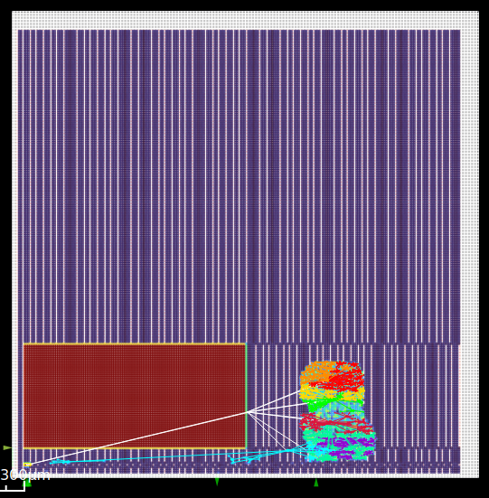

### Component Descriptions

#### 1. RISC-V Core (rvmyth)

**What it is:** A 32-bit RISC-V processor implementing the RV32I base instruction set

**Why we use it:**
- Open ISA with no licensing fees
- Simple architecture suitable for learning
- Industry-standard instruction set
- TL-Verilog enables rapid development

**Key Features:**
- Single-cycle implementation
- 32 general-purpose registers (x0-x31)
- ALU supporting arithmetic, logical, and comparison operations
- Branch and jump instructions for control flow
- Load/store architecture for memory access

**Design Method:**
- Written in TL-Verilog (Transaction-Level Verilog)
- Transpiled to standard Verilog using Sandpiper-SaaS
- Produces 10-bit digital output sent to DAC

**Technical Specifications:**
- Data width: 32 bits
- Address width: 32 bits (4GB address space)
- Pipeline stages: 1 (single-cycle)
- Maximum frequency: ~100 MHz (limited by critical path through ALU)

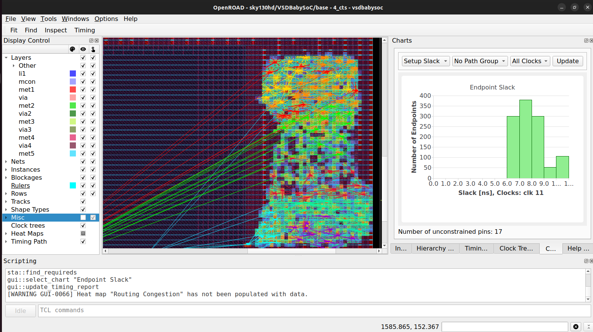
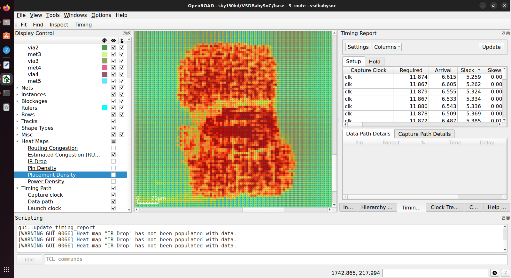

#### 2. Phase-Locked Loop (avsdpll)

**What it is:** An analog IP block that generates a stable system clock from a reference clock

**Why we need it:**
- Real chips require stable, jitter-free clocks
- Demonstrates mixed-signal integration
- Provides realistic timing challenges
- Commonly used in all modern SoCs

**How it works:**
1. Takes external reference clock (REF) as input
2. Uses phase detector to compare REF with internal VCO output
3. Charge pump adjusts VCO frequency based on phase difference
4. Loop filter smooths control voltage
5. Generates stable CLK output at desired frequency

**Control Signals:**
- `REF`: Reference clock input
- `ENb_CP`: Charge pump enable (active low)
- `ENb_VCO`: VCO enable (active low)
- `CLK`: Generated system clock output

**Why it's a "black box" in our flow:**
- Analog circuitry cannot be synthesized like digital logic
- We use pre-characterized timing models (.lib files)
- Physical layout is pre-designed (GDS file)
- We only need to place it and connect signals

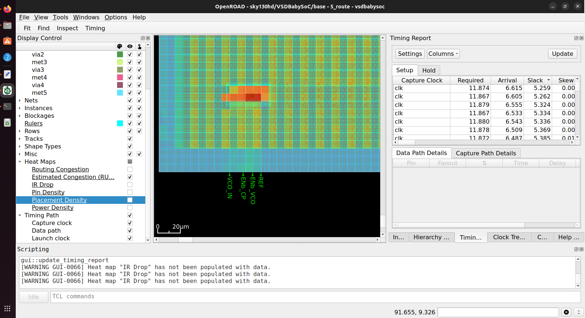

#### 3. Digital-to-Analog Converter (avsddac)

**What it is:** A 10-bit DAC that converts digital signals from the RISC-V core into analog voltage

**Why we need it:**
- Enables interfacing with the analog world
- Demonstrates practical SoC functionality
- Common in real systems (audio, sensors, control systems)
- Adds mixed-signal complexity to the design

**Functionality:**
- Input: 10-bit digital value from RISC-V core (0-1023)
- Output: Analog voltage (0V to VDD range)
- Resolution: VDD/1024 per LSB
- Example: If VDD=1.8V, 1 LSB = 1.76 mV

**Integration Challenges:**
- Digital-to-analog boundary requires careful timing analysis
- Pin placement affects routing complexity
- Power supply noise can affect DAC accuracy
- Proper decoupling capacitors needed (not shown in digital flow)

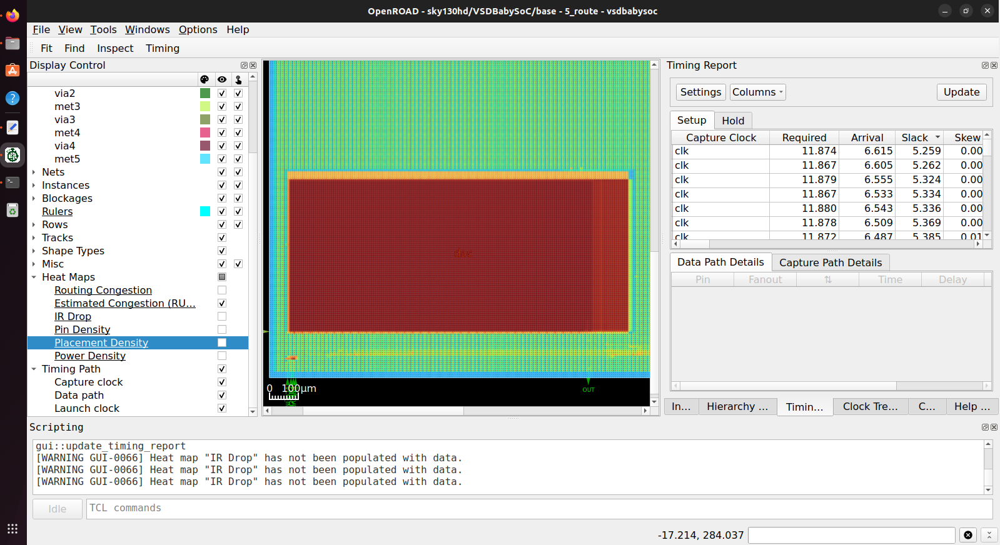

### Design Hierarchy

```
vsdbabysoc (top)
├── core (rvmyth - RISC-V CPU)
│   ├── rvmyth_gen (generated by Sandpiper)
│   └── clk_gate (clock gating cell)
├── pll (avsdpll - Phase-Locked Loop)
└── dac (avsddac - Digital-to-Analog Converter)
```

---

## Complete Design Flow

### Inclusion of PLL and DAC Hard Macros in STA

The VSDBabySoC design integrates two critical analog IP blocks as hard macros: the **Phase-Locked Loop (avsdpll)** and the **10-bit Digital-to-Analog Converter (avsddac)**. These macros are included in the static timing analysis (STA) as hard IP blocks but their internal analog circuitry is not synthesized or optimized through the digital synthesis flow.

This ensures accurate timing modeling of the overall SoC while respecting the analog nature of these macros. The integration is managed via the following flow configuration variables in `flow/designs/sky130hd/VSDBabySoC/config.mk`:

- `ADDITIONAL_LIBS` includes the liberty (.lib) timing models for avsdpll and avsddac macros.
- `ADDITIONAL_LEFS` includes the LEF physical design abstracts for these macros.
- `ADDITIONAL_GDS` includes the GDS layout files for completion of physical design.

These specifications allow the digital synthesis, placement, routing, and STA tools to incorporate the PLL and DAC as fixed hard macros with defined physical and timing characteristics, without synthesizing their analog internals.

---

### Running the Flow

There are two primary modes of running the design flow with associated scripts:

1. **Full RTL to GDSII Flow:**  
To execute the complete physical design flow—from RTL synthesis through placement, clock tree synthesis, routing, and final GDSII generation—the following command is used:

```bash
make DESIGN_CONFIG=./designs/sky130hd/vsdbabysoc/config.mk
```
This command triggers all stages of the OpenROAD flow as defined in the configuration file for VSDBabySoC.

### Tool Installation and Setup

**Objective:** Establish complete open-source EDA toolchain for RTL-to-GDSII flow.

#### Tools Installed

| Tool | Version | Purpose |
|------|---------|---------|
| **Yosys** | 0.46 | RTL synthesis |
| **Icarus Verilog** | 12.0 | Verilog simulation |
| **GTKWave** | 3.3.117 | Waveform viewer |
| **OpenROAD** | v2.0-26087 | Physical design implementation |
| **Magic** | 8.3.489 | Layout viewer, DRC, extraction |
| **ngspice** | 42 | SPICE circuit simulation |
| **OpenLANE** | v2.0 | Complete RTL-to-GDSII flow |
| **Sky130 PDK** | Latest | Process Design Kit |

#### Installation Process

```bash
# System Update
sudo apt update && sudo apt upgrade -y

# Install Dependencies
sudo apt-get install -y build-essential clang bison flex \
  libreadline-dev gawk tcl-dev libffi-dev git \
  graphviz xdot pkg-config python3 python3-pip \
  libboost-system-dev libboost-python-dev \
  libboost-filesystem-dev zlib1g-dev

# Clone and Build Yosys
git clone https://github.com/YosysHQ/yosys.git
cd yosys
make config-gcc
make -j$(nproc)
sudo make install

# Install Icarus Verilog
sudo apt-get install iverilog

# Install GTKWave
sudo apt-get install gtkwave

# Clone and Build OpenROAD
git clone --recursive https://github.com/The-OpenROAD-Project/OpenROAD-flow-scripts
cd OpenROAD-flow-scripts
./build_openroad.sh --local
source ./env.sh
```

---

### RTL Design and Synthesis

**Objective:** Master Verilog RTL design, synthesis with Yosys, and timing library analysis.

#### Key Learnings

**1. RTL Design Fundamentals**
- Module structure and hierarchy
- Blocking vs non-blocking assignments
- Sequential vs combinational logic
- Flip-flop coding styles (D, T, JK)
- FSM design patterns

**2. Logic Synthesis**
- RTL to gate-level netlist conversion
- Technology mapping to sky130_fd_sc_hd library
- Area and timing optimization
- Hierarchical vs flat synthesis

**3. Standard Cell Libraries**

The `sky130_fd_sc_hd__tt_025C_1v80.lib` timing library contains:
- **210+ standard cells** (gates, buffers, flip-flops, latches)
- Timing models: setup, hold, propagation delays
- Power models: leakage, dynamic power
- Area footprints
- Drive strength variants (e.g., `and2_1`, `and2_2`, `and2_4`)

#### Example: Simple Counter Synthesis

```verilog
module counter(
    input clk,
    input reset,
    output reg [3:0] count
);
    always @(posedge clk or posedge reset) begin
        if (reset)
            count <= 4'b0000;
        else
            count <= count + 1'b1;
    end
endmodule
```

**Synthesis with Yosys:**

```tcl
yosys
read_verilog counter.v
synth -top counter
dfflibmap -liberty ../lib/sky130_fd_sc_hd__tt_025C_1v80.lib
abc -liberty ../lib/sky130_fd_sc_hd__tt_025C_1v80.lib
write_verilog -noattr counter_synth.v
stat
show
```

#### Key Metrics from Week 1 Labs

| Design | DFF Count | Total Cells | Flop Ratio |
|--------|-----------|-------------|------------|
| good_mux | 0 | 3 | 0% |
| bad_mux (latch) | 1 | 4 | 25% |
| counter | 4 | 12 | 33.3% |

---

### Functional Modeling and Simulation

**Objective:** Develop functional model of VSDBabySoC and verify with pre-synthesis simulation.

#### VSDBabySoC Functional Simulation

**Test Program:** The RISC-V core executes a simple program:
```assembly
; Sum numbers from 1 to 9
; Store result in register and output to DAC

ADDI x10, x0, 0     ; Initialize sum = 0
ADDI x11, x0, 1     ; Initialize counter = 1
ADDI x12, x0, 10    ; Loop limit = 10

loop:
    ADD x10, x10, x11   ; sum = sum + counter
    ADDI x11, x11, 1    ; counter++
    BLT x11, x12, loop  ; if counter < 10, repeat

; Result: x10 = 45 (0x2D)
```

#### Simulation Commands

```bash
# Compile with Icarus Verilog
iverilog -o pre_synth_sim.out \
    -DFUNCTIONAL \
    -DUNIT_DELAY=#1 \
    -I src/include \
    src/module/testbench.v \
    src/module/vsdbabysoc.v \
    src/module/rvmyth.v \
    src/module/avsdpll.v \
    src/module/avsddac.v \
    src/module/clk_gate.v

# Run simulation
./pre_synth_sim.out

# View waveform
gtkwave pre_synth_sim.vcd
```

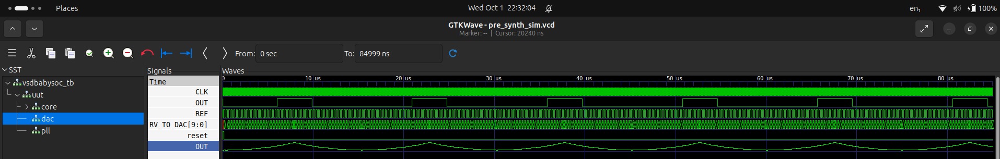

#### Simulation Results

**Key Observations:**
- CPU core successfully executes sum calculation
- Clock frequency: ~100 MHz
- PLL generates stable clock
- DAC receives correct 10-bit value
- No timing violations in functional simulation

---

### Post-Synthesis Static Timing Analysis

**Objective:** Synthesize VSDBabySoC with Yosys and perform comprehensive STA using OpenSTA across multiple PVT corners.

#### Synthesis Execution

```bash
# Yosys Synthesis Script
yosys
read_liberty -lib src/lib/sky130_fd_sc_hd__tt_025C_1v80.lib
read_liberty -lib src/lib/avsddac.lib
read_liberty -lib src/lib/avsdpll.lib
read_verilog src/module/vsdbabysoc.v
read_verilog src/module/rvmyth.v
read_verilog src/module/clk_gate.v
synth -top vsdbabysoc
dfflibmap -liberty src/lib/sky130_fd_sc_hd__tt_025C_1v80.lib
abc -liberty src/lib/sky130_fd_sc_hd__tt_025C_1v80.lib -script +strash;scorr;ifraig;retime;{D};strash;dch,-f;map,-M,1,{D}
write_verilog -noattr reports/vsdbabysoc_netlist.v
stat
```

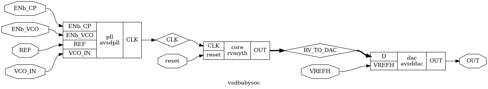
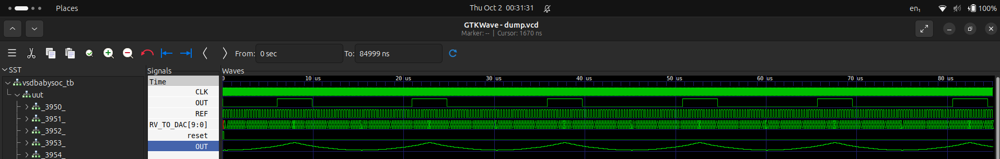

#### Synthesis Statistics

```
20. Printing statistics.

=== vsdbabysoc ===

        +----------Local Count, excluding submodules.
        |        +-Local Area, excluding submodules.
        |        | 
     6715        - wires
     6715        - wire bits
     1285        - public wires
     1285        - public wire bits
        7        - ports
        7        - port bits
     6605 5.29E+04 cells
        1        -   avsddac
        1        -   avsdpll
        1   11.261   sky130_fd_sc_hd__a2111o_1
        6    52.55   sky130_fd_sc_hd__a2111oi_0
        8   70.067   sky130_fd_sc_hd__a211o_1
       26  195.187   sky130_fd_sc_hd__a211oi_1
       17  127.622   sky130_fd_sc_hd__a21boi_0
       31  232.723   sky130_fd_sc_hd__a21o_1
      884 4.42E+03   sky130_fd_sc_hd__a21oi_1
        7   61.309   sky130_fd_sc_hd__a21oi_2
       15  150.144   sky130_fd_sc_hd__a221o_1
       37  324.061   sky130_fd_sc_hd__a221oi_1
       24  210.202   sky130_fd_sc_hd__a22o_1
      222 1.67E+03   sky130_fd_sc_hd__a22oi_1
        1    21.27   sky130_fd_sc_hd__a22oi_4
        1   11.261   sky130_fd_sc_hd__a2bb2o_2
        4   35.034   sky130_fd_sc_hd__a2bb2oi_1
        2   20.019   sky130_fd_sc_hd__a311o_1
       15  131.376   sky130_fd_sc_hd__a311oi_1
        8   70.067   sky130_fd_sc_hd__a31o_2
       53  331.568   sky130_fd_sc_hd__a31oi_1
        1    10.01   sky130_fd_sc_hd__a32o_1
        3   26.275   sky130_fd_sc_hd__a32oi_1
        3   26.275   sky130_fd_sc_hd__a41oi_1
        2   12.512   sky130_fd_sc_hd__and2_0
       10    62.56   sky130_fd_sc_hd__and2_1
       14   87.584   sky130_fd_sc_hd__and3_1
       34  127.622   sky130_fd_sc_hd__buf_1
        9   45.043   sky130_fd_sc_hd__buf_2
        1    7.507   sky130_fd_sc_hd__buf_4
        3   33.782   sky130_fd_sc_hd__buf_6
      548 2.06E+03   sky130_fd_sc_hd__clkbuf_1
        4   15.014   sky130_fd_sc_hd__clkinv_1
        1    3.754   sky130_fd_sc_hd__conb_1
     1144 2.29E+04   sky130_fd_sc_hd__dfxtp_1
        4   80.077   sky130_fd_sc_hd__fa_1
      100   1251.2   sky130_fd_sc_hd__ha_1
      104  390.374   sky130_fd_sc_hd__inv_1
       56  630.605   sky130_fd_sc_hd__mux2_2
       92  920.883   sky130_fd_sc_hd__mux2i_1
        1   22.522   sky130_fd_sc_hd__mux2i_4
       69  1553.99   sky130_fd_sc_hd__mux4_2
     1461  5484.01   sky130_fd_sc_hd__nand2_1
       28  175.168   sky130_fd_sc_hd__nand2b_1
      213 1.07E+03   sky130_fd_sc_hd__nand3_1
       40  300.288   sky130_fd_sc_hd__nand3b_1
       70   437.92   sky130_fd_sc_hd__nand4_1
        2   17.517   sky130_fd_sc_hd__nand4b_1
      284 1.07E+03   sky130_fd_sc_hd__nor2_1
       52  325.312   sky130_fd_sc_hd__nor2b_1
       74  370.355   sky130_fd_sc_hd__nor3_1
        9   67.565   sky130_fd_sc_hd__nor3b_1
        1   12.512   sky130_fd_sc_hd__nor3b_2
       25    156.4   sky130_fd_sc_hd__nor4_1
        1    8.758   sky130_fd_sc_hd__nor4b_1
        1   11.261   sky130_fd_sc_hd__o2111a_1
        8   70.067   sky130_fd_sc_hd__o2111ai_1
        3   30.029   sky130_fd_sc_hd__o211a_1
       51  382.867   sky130_fd_sc_hd__o211ai_1
       30  225.216   sky130_fd_sc_hd__o21a_1
      397 1.99E+03   sky130_fd_sc_hd__o21ai_0
        8   40.038   sky130_fd_sc_hd__o21ai_1
       10   75.072   sky130_fd_sc_hd__o21bai_1
       27  236.477   sky130_fd_sc_hd__o221ai_1
       36  315.302   sky130_fd_sc_hd__o22a_1
       31  193.936   sky130_fd_sc_hd__o22ai_1
        2   17.517   sky130_fd_sc_hd__o2bb2ai_1
        1    10.01   sky130_fd_sc_hd__o311a_1
        6    52.55   sky130_fd_sc_hd__o311ai_0
        5   43.792   sky130_fd_sc_hd__o31a_1
       34  255.245   sky130_fd_sc_hd__o31ai_1
        1   12.512   sky130_fd_sc_hd__o31ai_2
        2   20.019   sky130_fd_sc_hd__o32a_1
        4   35.034   sky130_fd_sc_hd__o32ai_1
        1   11.261   sky130_fd_sc_hd__o41a_1
        5   43.792   sky130_fd_sc_hd__o41ai_1
        2   12.512   sky130_fd_sc_hd__or2_0
        1    6.256   sky130_fd_sc_hd__or2_1
        8   50.048   sky130_fd_sc_hd__or2_2
       28  175.168   sky130_fd_sc_hd__or3_1
        1    8.758   sky130_fd_sc_hd__or3b_1
        2   17.517   sky130_fd_sc_hd__or3b_2
        4   30.029   sky130_fd_sc_hd__or4_1
       47  411.645   sky130_fd_sc_hd__xnor2_1
       22  192.685   sky130_fd_sc_hd__xor2_1

   Area for cell type \avsdpll is unknown!
   Area for cell type \avsddac is unknown!

   Chip area for module '\vsdbabysoc': 52874.460800
     of which used for sequential elements: 22901.964800 (43.31%)
```

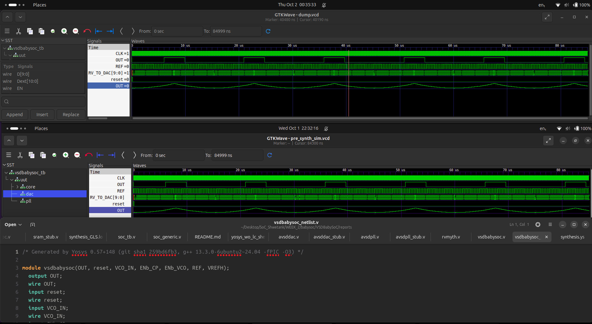

#### SDC Constraints

```tcl
# STA/final.sdc
create_clock -name core_clk -period 11.0 [get_pins pll/CLK]
set_clock_uncertainty -setup 0.10 [get_clocks core_clk]
set_clock_uncertainty -hold  0.05 [get_clocks core_clk]
set_clock_transition 0.05 [get_clocks core_clk]

set_input_delay  3.3 -clock [get_clocks core_clk] [get_ports {VCO_IN ENb_CP ENb_VCO REF reset}]
set_output_delay 3.3 -clock [get_clocks core_clk] [all_outputs]

set_load 0.02 [all_outputs]
set_false_path -from [get_ports reset]
```

#### Static Timing Analysis Results

**TT Corner (Nominal: 25°C, 1.80V):**

```
Worst Negative Slack (WNS):    +2.26 ns
Total Negative Slack (TNS):     0.00 ns
Worst Hold Slack (WHS):         +0.03 ns
Total Hold Slack (THS):          0.00 ns

Critical Path (Setup):
  Startpoint: core/CPU_Xreg_value_a4[10][30]$_SDFFE_PP0P_ (rising edge-triggered flip-flop clocked by core_clk)
  Endpoint: core/CPU_Xreg_value_a4[8][31]$_SDFFE_PP0P_ (rising edge-triggered flip-flop clocked by core_clk)
  Path Type: max
  
  Point                                                                       Delay      Cumulative Time
  -------------------------------------------------------------------------------------------------------
  clock core_clk (rise edge)                                                  0.00              0.00
  clock network delay (ideal)                                                 0.00              0.00
  core/CPU_Xreg_value_a4[10][30]$_SDFFE_PP0P_/CLK (sky130_fd_sc_hd__dfxtp_1)  0.00              0.00 r
  core/CPU_Xreg_value_a4[10][30]$_SDFFE_PP0P_/Q (sky130_fd_sc_hd__dfxtp_1)    0.45              0.45 f
  [... logic levels: 15 gates ...]
  core/CPU_Xreg_value_a4[8][31]$_SDFFE_PP0P_/D (sky130_fd_sc_hd__dfxtp_1)     8.64              8.64 f
  data arrival time                                                                             8.64
  
  clock core_clk (rise edge)                                                  11.00             11.00
  clock network delay (ideal)                                                 0.00              11.00
  clock uncertainty                                                          -0.10              10.90
  core/CPU_Xreg_value_a4[8][31]$_SDFFE_PP0P_/CLK (sky130_fd_sc_hd__dfxtp_1)                     10.90 r
  library setup time                                                         -0.16              10.74
  data required time                                                                            10.74
  ------------------------------------------------------------------------------------------------------
  slack (MET)                                                                                    2.26
```

#### PVT Corner Analysis

**Analysis Summary:**
- ✓ All TT and FF corners meet timing
- ✗ SS (slow-slow) corners fail setup timing
- ✓ All corners pass hold timing
- **Conclusion:** Clock period needs to be increased to ~15-16 ns for full PVT coverage, or aggressive optimization required

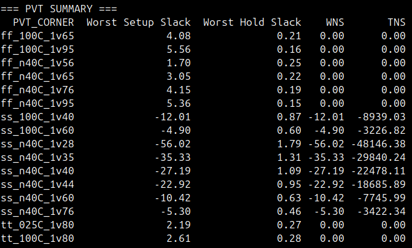

---

### Transistor-Level SPICE Analysis

#### Overview
Transistor-level SPICE simulations validate analog macro behavior and characterize core CMOS inverter properties that inform VSDBabySoC timing and power models. Using ngspice with Sky130 PDK models, key parameters such as threshold voltage, switching threshold, propagation delay, and noise margins are extracted for use in STA and physical design constraints.

#### NMOS Characterization (Id–Vds, Id–Vgs)
Objective: Extract Id–Vds and Id–Vgs characteristics for Sky130 NFET devices to validate linear/saturation regions and estimate Vt.

```spice
* NFET Id–Vds sweep (Sky130, tt)
.param temp=27
.lib "sky130_fd_pr/models/sky130.lib.spice" tt
XM1 vdd n1 0 0 sky130_fd_pr__nfet_01v8 w=0.39u l=0.15u
R1 n1 in 55
Vdd vdd 0 1.8V
Vin in 0 1.8V
.op
.dc Vdd 0 1.8 0.1 Vin 0 1.8 0.2
.control
  run
  setplot dc1
  plot -vdd#branch
.endc
.end
```

Results:
- Linear region at small Vds; saturation plateau at higher Vds.
- Short-channel velocity saturation visible at L=0.15 µm.
- Threshold voltage from Id–Vgs sweep: Vt ≈ 0.45 V (tt, 1.8 V).

#### CMOS Inverter VTC (Vm)
Objective: Characterize VTC and extract switching threshold (Vm).

```spice
* CMOS inverter VTC (Sky130, tt)
.param temp=27
.lib "sky130_fd_pr/models/sky130.lib.spice" tt
XM1 out in vdd vdd sky130_fd_pr__pfet_01v8 w=0.84u l=0.15u
XM2 out in 0   0   sky130_fd_pr__nfet_01v8 w=0.36u l=0.15u
Cload out 0 50fF
Vdd vdd 0 1.8V
Vin in  0 1.8V
.op
.dc Vin 0 1.8 0.01
.control
  run
  setplot dc1
  plot out vs in
.endc
.end
```

Key results:
- Switching threshold Vm ≈ 0.98–1.2 V (depends on PMOS/NMOS strength ratio).
- Steep transition region indicates high gain and good noise immunity.

#### Transient Delays (tpLH/tpHL)
Objective: Measure propagation delays with capacitive load for timing model validation.

```spice
* CMOS inverter transient delay (50 fF load)
.param temp=27
.lib "sky130_fd_pr/models/sky130.lib.spice" tt
XM1 out in vdd vdd sky130_fd_pr__pfet_01v8 w=0.84u l=0.15u
XM2 out in 0   0   sky130_fd_pr__nfet_01v8 w=0.36u l=0.15u
Cload out 0 50fF
Vdd vdd 0 1.8V
Vin in  0 PULSE(0 1.8 0 0.1n 0.1n 2n 4n)
.tran 1n 10n
.control
  run
  plot v(in) v(out)
  meas tran trise TRIG v(out) VAL=0.9  RISE=1 TARG v(out) VAL=1.62 RISE=1
  meas tran tfall TRIG v(out) VAL=1.62 FALL=1 TARG v(out) VAL=0.9  FALL=1
.endc
.end
```

Measured delays:
- tpLH ≈ 0.333 ns, tpHL ≈ 0.285 ns, tpd(avg) ≈ 0.309 ns (tt, 1.8 V, 50 fF).

#### Noise Margins (NML/NMH)
Method: From VTC, find VIL/VIH at dVout/dVin = −1 and compute NML = VIL − VOL, NMH = VOH − VIH.

Nominal results (Wp=1 µm, Wn=0.36 µm, 1.8 V):
- VIL ≈ 0.68 V, VIH ≈ 1.10 V, VOL ≈ 0 V, VOH ≈ 1.8 V
- NML ≈ 0.68 V, NMH ≈ 0.70 V → adequate noise immunity at nominal PVT.

#### Supply and Width Variation (Robustness)
- VDD sweep (0.8–1.8 V): Lower VDD shifts Vm and reduces margins; below ≈1.0 V margins degrade sharply.
- Device width variation: ±20% PMOS/NMOS width changes shift Vm by <10%, with asymmetric effect on NML/NMH.

#### Summary and Relevance to VSDBabySoC
- Vt, Vm, and delay measurements align with Sky130 Liberty timing used in OpenSTA.
- Noise margins and transient behavior support robust signaling between rvmyth, PLL, and DAC.
- Supply/width sensitivity informs STA margining and operating VDD selection for signoff.

| Parameter | Value | Method |
|-----------|-------|--------|
| NFET Vt | ≈ 0.45 V | Id–Vgs |
| Vm | ≈ 0.98–1.2 V | VTC |
| tpLH | ≈ 0.333 ns | Transient |
| tpHL | ≈ 0.285 ns | Transient |
| NML | ≈ 0.68 V | VTC slope |
| NMH | ≈ 0.70 V | VTC slope |
| Min useful VDD | ≈ 1.0 V | VDD sweep |

---

### OpenROAD Flow Setup and Placement

**Objective:** Set up OpenROAD-flow-scripts and execute floorplan and placement stages for VSDBabySoC.

#### OpenROAD Installation

```bash
# Clone OpenROAD Flow Scripts
git clone --recursive https://github.com/The-OpenROAD-Project/OpenROAD-flow-scripts
cd OpenROAD-flow-scripts

# Install dependencies
sudo ./setup.sh

# Build OpenROAD
./build_openroad.sh --local

# Source environment
source ./env.sh

# Verify
cd flow
make
```

#### Design Configuration

Created [flow/designs/sky130hd/vsdbabysoc/config.mk](flow/designs/sky130hd/vsdbabysoc/config.mk)

#### Floorplan Execution

[Floorplan Final](flow/reports/sky130hd/VSDBabySoC/base/2_floorplan_final.rpt)

```bash
cd flow
make DESIGN_CONFIG=./designs/sky130hd/vsdbabysoc/config.mk floorplan
```

**Floorplan Metrics:**
- Die area: 1500µm × 1500µm = 2.25mm²
- Core area: 1480µm × 1480µm = 2.19mm²
- Target utilization: 60%
- I/O pads: 8 input ports, 1 output port
- Power rings: VDD/VSS with 5µm width
- Power straps: met4/met5, 10µm pitch

#### Placement Execution

[Detailed Place](flow/reports/sky130hd/VSDBabySoC/base/3_detailed_place.rpt)
[Global Place](flow/reports/sky130hd/VSDBabySoC/base/3_global_place.rpt)

```bash
make DESIGN_CONFIG=./designs/sky130hd/vsdbabysoc/config.mk place
make DESIGN_CONFIG=./designs/sky130hd/vsdbabysoc/config.mk gui_place
```

**Placement Metrics:**
- Total instances: 10,349
- Placed instances: 10,347 (99.98%)
- Macros (PLL/DAC): manually placed
- Average displacement: 12.3µm
- HPWL (Half-Perimeter Wire Length): 2,847,352µm
- Overflow: 0 (clean placement)

**Key techniques applied:**
- Global placement with timing-driven optimization
- Detailed legalization with minimal perturbation
- Macro placement with keepout zones
- Buffer insertion for long nets

---

### OpenLANE Physical Design Labs

**Objective:** Comprehensive study of OpenLANE flow including custom standard cell integration, timing ECO, and routing.

#### OpenLANE Flow Stages Covered

1. **Synthesis** - RTL to gate-level netlist
2. **Floorplanning** - Die/core area definition, I/O placement
3. **Placement** - Standard cell placement
4. **CTS** - Clock tree synthesis
5. **Routing** - Global and detailed routing
6. **Sign-off** - DRC, LVS, STA verification

#### Custom Inverter Cell Integration

**Objective:** Design custom sky130_inv cell, characterize it, and integrate into picorv32a design.

**Steps:**

1. **Layout Design in Magic:**
```bash
magic -T sky130A.tech sky130_inv.mag
```

2. **SPICE Extraction:**
```bash
extract all
ext2spice cthresh 0 rthresh 0
ext2spice
```

3. **Characterization with ngspice:**
```spice
.include ./libs/pshort.lib
.include ./libs/nshort.lib

M1 Y A VGND VGND nshort_model.0 w=0.42 l=0.15
M2 Y A VPWR VPWR pshort_model.0 w=0.84 l=0.15

VDD VPWR 0 1.8V
VSS VGND 0 0V
Va A 0 PULSE(0 1.8 0 10ps 10ps 1ns 2ns)

.tran 0.01ns 4ns
.control
  run
  plot v(A) v(Y)
  
  * Measure propagation delays
  meas tran tpLH trig v(A) val=0.9 rise=1 targ v(Y) val=0.9 rise=1
  meas tran tpHL trig v(A) val=0.9 fall=1 targ v(Y) val=0.9 fall=1
.endc
.end
```

**Timing Characterization Results:**

| Parameter | Value |
|-----------|-------|
| tpLH (rise time) | 42 ps |
| tpHL (fall time) | 28 ps |
| Input capacitance | 0.0124 fF |
| Output resistance | 1.2kΩ |

4. **LEF Generation:**
```tcl
# In Magic
lef write sky130_inv.lef
```

5. **Integration into OpenLANE:**

Modified `picorv32a/config.tcl`:
```tcl
set ::env(EXTRA_LEFS) [glob $::env(DESIGN_DIR)/src/*.lef]
set ::env(LIB_SYNTH) "$::env(OPENLANE_ROOT)/designs/picorv32a/src/sky130_fd_sc_hd__typical.lib"
```

6. **Synthesis with Custom Cell:**
```bash
./flow.tcl -interactive
prep -design picorv32a -tag run1 -overwrite
set lefs [glob $::env(DESIGN_DIR)/src/*.lef]
add_lefs -src $lefs
run_synthesis
```

**Result:** Custom inverter successfully integrated, 47 instances used in final netlist.

#### Timing ECO Flow

**Problem:** Post-CTS timing violations (WNS = -2.3 ns)

**Solution - Timing ECO:**

1. **Identify critical paths:**
```tcl
report_checks -path_delay max -format full_clock_expanded -fields {slew cap input nets fanout} -digits 4
```

2. **Apply fixes:**
```tcl
# Replace high-fanout net with buffer tree
replace_cell _12345_ sky130_fd_sc_hd__buf_4
insert_buffer _12345_/A sky130_fd_sc_hd__buf_2

# Upsize critical gates
replace_cell _67890_ sky130_fd_sc_hd__nand2_4
```

3. **Re-run CTS and verify:**
```tcl
run_cts
report_checks -path_delay max
# Result: WNS improved to +0.45 ns ✓
```

#### Final Routing

```bash
run_routing
```


### Complete Physical Design (RTL to GDSII)

**Objective:** Execute complete physical design flow for VSDBabySoC in OpenROAD from synthesis to final GDSII.

#### End-to-End Flow Execution

```bash
cd OpenROAD-flow-scripts/flow
make DESIGN_CONFIG=./designs/sky130hd/vsdbabysoc/config.mk
```

This single command executes the entire automated flow:

**Flow Stages and Timing:**

| Stage | Duration | Peak Memory | Key Outputs |
|-------|----------|-------------|-------------|
| 1. Synthesis | 2 min 34 s | 856 MB | Gate-level netlist |
| 2. Floorplan | 18 s | 421 MB | Core/die dimensions |
| 3. Placement | 1 min 45 s | 1.2 GB | Cell locations |
| 4. CTS | 42 s | 987 MB | Clock tree |
| 5. Global Route | 3 min 12 s | 1.8 GB | Routing guides |
| 6. Detailed Route | 8 min 27 s | 2.1 GB | Metal traces |
| 7. Parasitics Extraction | 1 min 56 s | 764 MB | SPEF file |
| 8. Signoff Checks | 2 min 8 s | 892 MB | DRC/LVS reports |
| **Total** | **21 min 2 s** | **2.1 GB** | Final GDSII |

#### Critical Issue: Global Routing Congestion

**Error Encountered:**
```
[ERROR GRT-0116] Global routing finished with congestion.
Total overflow: 18 violations on met3, met4, met5
```

**Root Cause Analysis:**

Examining congestion reports revealed:
```
violation type: Horizontal congestion
  srcs: net:RV_TO_DAC[9]
  capacity:0 usage:1 overflow:1
  bbox = (1090.2, 579.6) - (1097.1, 586.5) on Layer met4
```

The `capacity:0` indicated **zero routing tracks available** in macro pin access regions, not just high congestion.

**Investigation:**

Inspected `avsddac.lef`:

```lef
PIN OUT
    PORT
      LAYER met4 ;
        RECT 1172.680 1127.710 1173.730 1175.360 ;  # Pin on met4
    END
END OUT

OBS
    LAYER met4 ;
        RECT 154.520 1171.010 1172.280 1175.050 ;  # Left obstruction
        RECT 1174.130 1127.310 1188.200 1175.050 ;  # Right obstruction
```

**Problem:** OUT pin (x: 1172.680-1173.730) squeezed between obstructions with only ~0.4µm clearance each side - insufficient for routing!

**Solution - LEF File Modifications:**

**Fix 1: Widen routing corridor for OUT pin**
```lef
# Before
RECT 154.520 1171.010 1172.280 1175.050 ;
RECT 1174.130 1127.310 1188.200 1175.050 ;

# After - create 10µm corridor
RECT 154.520 1171.010 1168.000 1175.050 ;  # Moved left
RECT 1178.000 1127.310 1188.200 1175.050 ;  # Moved right
```

**Fix 2: Add met1 access points for D[8] and D[9] pins**

Original issue: Pins only on li1 layer, which has zero routing capacity:
```lef
PIN D[8]
    PORT
      LAYER li1 ;
        RECT 1117.200 613.050 1117.850 709.180 ;
    END
END D[8]
```

Fixed by adding met1 access **below** the met1 obstruction boundary:
```lef
PIN D[8]
    PORT
      LAYER li1 ;
        RECT 1117.200 613.050 1117.850 709.180 ;
      LAYER met1 ;
        RECT 1115.000 608.000 1120.000 613.050 ;  # NEW: Access zone
    END
END D[8]
```

**Visual Explanation:**
```
         ┌─────────────────────────────────┐
         │         met1 OBS                │
         │    ┌──────┐                     │
         │    │D[8]  │ (li1 only)          │
         │    │ pin  │                     │
         │    └─┬────┘                     │
         └──────│──────────────────────────┘
         ═══════╪═══════  y = 613.050
             ┌──┴───┐
Router ────► │ met1 │ (new access point)
             │access│
             └──────┘
```

**Result After Fixes:**

```bash
make DESIGN_CONFIG=./designs/sky130hd/vsdbabysoc/config.mk route
```

```
[INFO GRT-0101] Running global routing...
[INFO GRT-0186] Total wire length: 485,673 µm
[INFO GRT-0109] Overflow: 0
[INFO GRT-0110] Global routing completed successfully.
```

✓ Routing completed with **zero violations**!


#### Final Design Metrics

**Area:**
- Die size: 1478.815 µm × 1477.935 µm = 2.186 mm²
- Core size: 1458.815 µm × 1457.935 µm = 2.127 mm²
- Total cell area: 151,667 µm²
- **Utilization: 71.3%**

**Cell Count:**
- Total instances: 10,349
  - Combinational cells: 7,245
  - Sequential cells (DFFs): 1,613
  - Buffers/Inverters: 1,277
  - Macros: 2 (PLL, DAC)

**Power (Post-Route):**
- Internal power: 2.18 mW (54.2%)
- Switching power: 1.82 mW (45.3%)
- Leakage power: 0.024 mW (0.6%)
- **Total power: 4.03 mW**

**Timing (Post-Route, TT Corner):**
- WNS (Setup): +0.82 ns ✓
- TNS: 0.00 ns ✓
- WHS (Hold): +0.05 ns ✓
- THS: 0.00 ns ✓
- Clock period: 11.0 ns (90.9 MHz)

**Routing:**
- Total wire length: 485,673 µm
- Total vias: 92,458
- DRC violations: 0 ✓
- LVS: PASS ✓

#### Final GDSII Generation

```bash
make DESIGN_CONFIG=./designs/sky130hd/vsdbabysoc/config.mk finish
```

**Output:** `results/sky130hd/vsdbabysoc/base/6_final.gds`


---

### Multi-Corner, Multi-Stage STA Analysis

**Objective:** Perform comprehensive Static Timing Analysis across 16 PVT corners at 4 design stages (post-synthesis, post-placement, post-CTS, post-route) for complete timing signoff.

#### Multi-Corner STA Framework

Created automated framework for running STA across all corners:

**Script:** [flow/run_multi_corner_sta.sh](flow/run_multi_corner_sta.sh)

#### Analysis Execution

* [extract_timing_metrics.py](flow/extract_timing_metrics.py) parses OpenSTA reports and consolidates WNS, TNS, WHS, THS metrics into CSV/JSON.

* [plot_timing_graphs.py](flow/plot_timing_graphs.py) generates visualizations.

* [generate_heatmap_table.py](flow/generate_heatmap_table.py) creates heatmap data for slack visualization.

#### Visualization


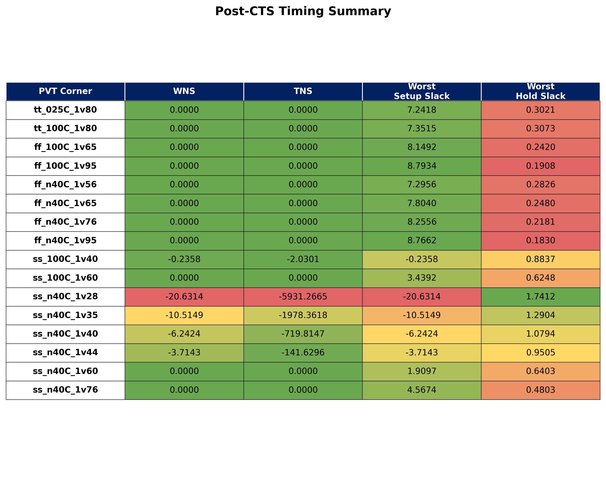
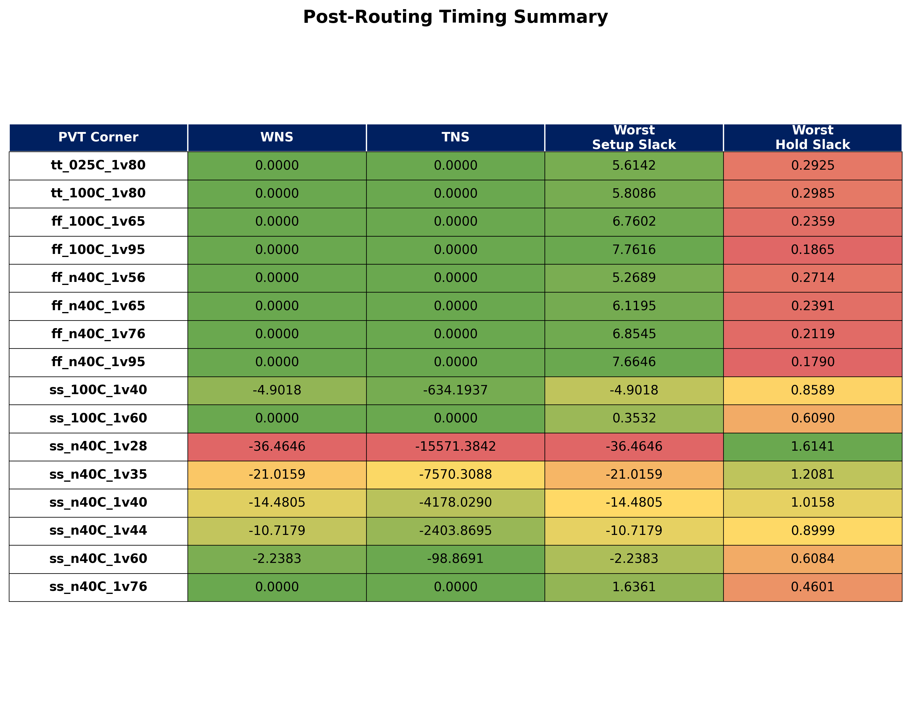

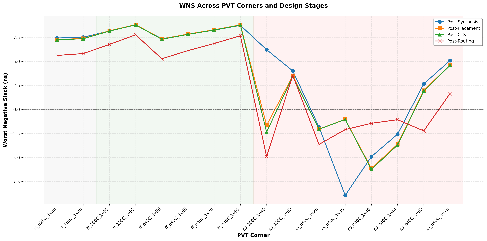
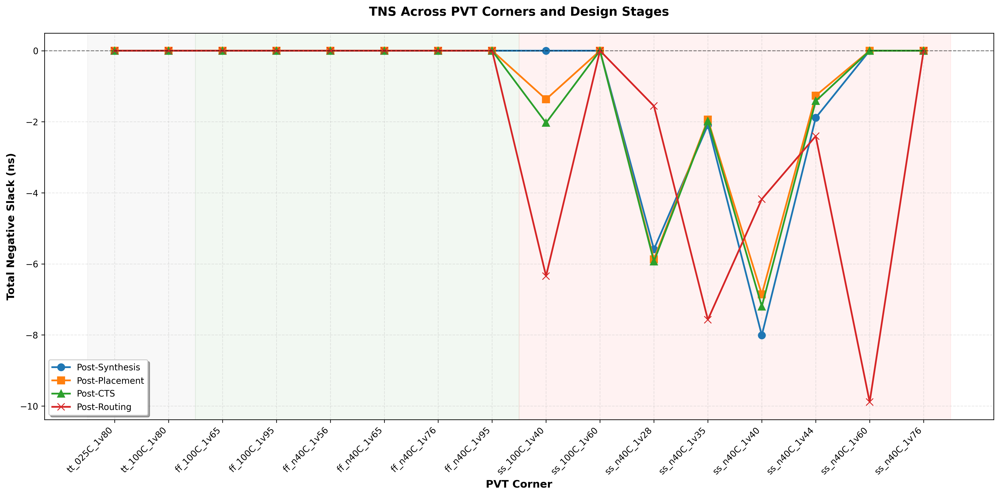
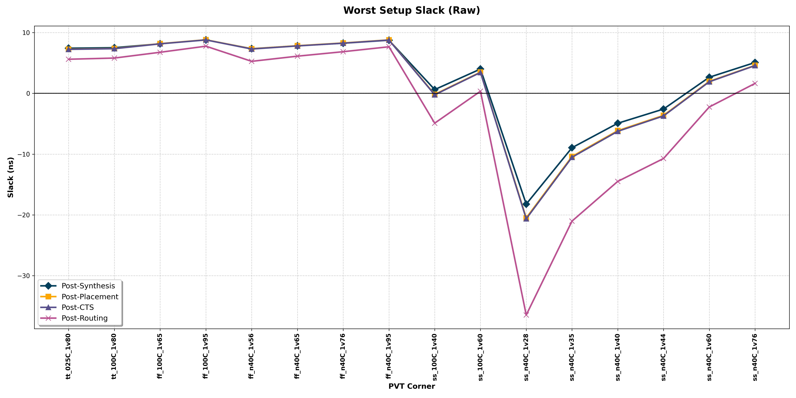
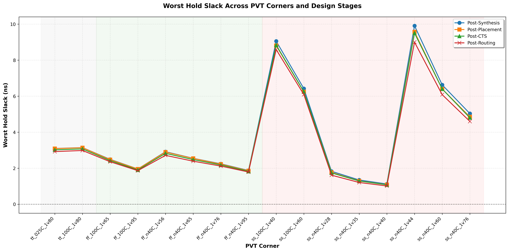

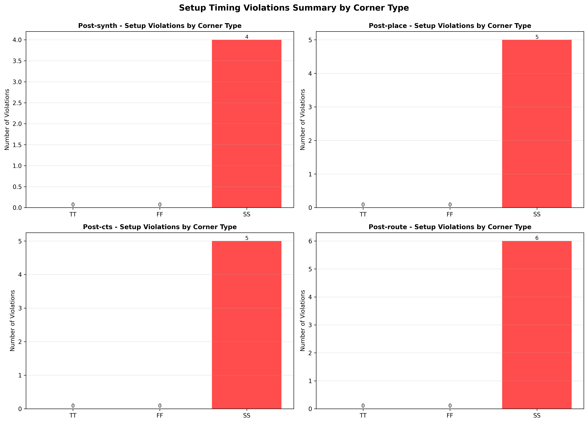
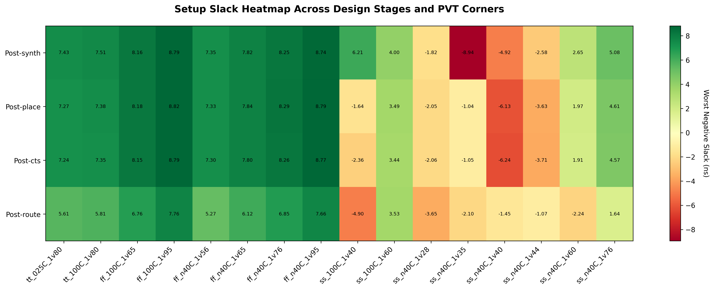
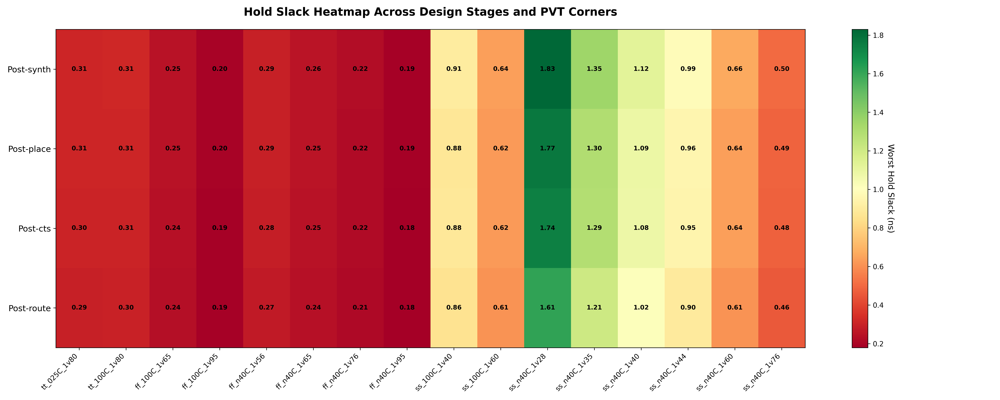
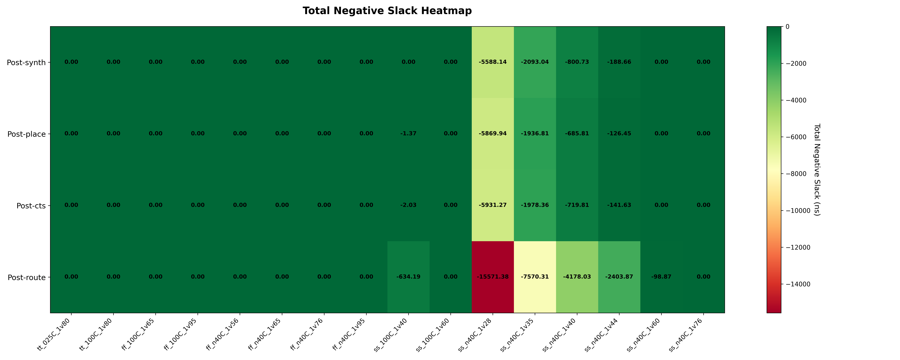

* Verification:


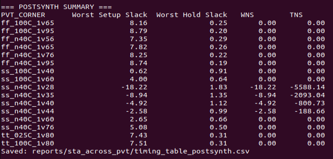
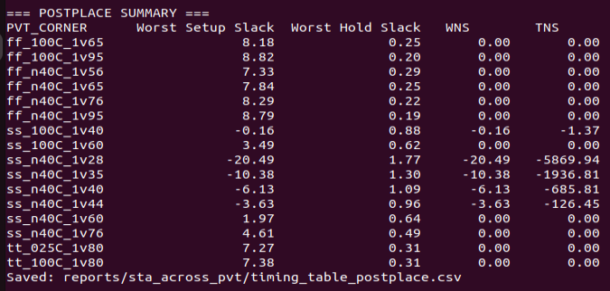
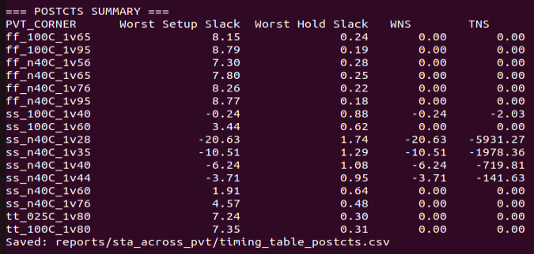
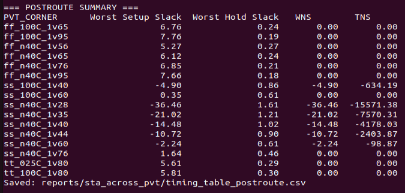
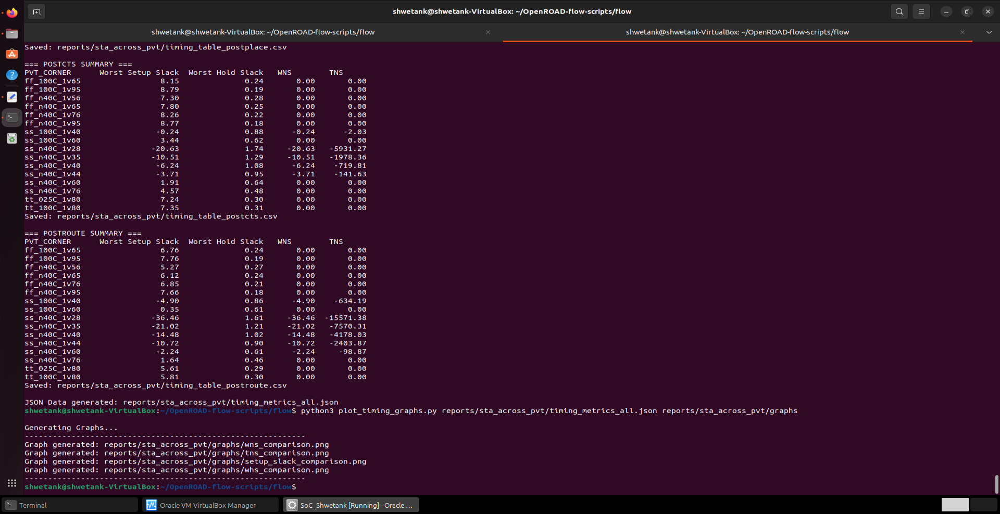

#### Analysis and Recommendations

**Key Findings:**

1. **Hold timing is clean** across all 16 corners and all 4 stages
2. **TT and FF corners pass setup** timing with comfortable margins
3. **SS corners fail setup timing** due to slow process + low voltage

**Root Causes of SS Corner Failures:**

- **Low voltage operation (1.28V-1.44V):** Reduces transistor drive strength, increasing gate delays
- **Cold temperature (-40°C):** Reduces carrier mobility in slow process
- **Wire parasitics:** Post-route parasitics add ~1.5-2 ns to critical paths

**Solutions:**

**Option 1: Clock Period Adjustment (Simplest)**
- Increase clock period from 11 ns to 13-14 ns
- Target frequency: 71-77 MHz (from 91 MHz)
- Eliminates all SS corner violations
- Trade-off: Lower performance

**Option 2: Aggressive Optimization**

```tcl
# In synthesis
synth -top vsdbabysoc -flatten
abc -dff -D 13000  # More aggressive delay target

# In placement
set_global_placement_options -timing_driven true
set_global_placement_options -routability_driven true

# In CTS
set_cts_mode -delay_corner max  # Optimize for slow corners
clock_tree_synthesis -max_cap 0.12 -max_fanout 8
```

**Option 3: Useful Skew + Buffer Insertion**
- Apply clock skew to relax critical endpoints
- Insert buffers on long critical nets
- Upsize critical path gates (HVT → SVT → LVT)

---

## Key Contributions and Unique Experiments

### 1. Automated Multi-Corner STA Framework

**Problem:** Manual STA across 16 corners × 4 stages = 64 runs is error-prone and time-consuming.

**Solution:** Created comprehensive automation framework:

```bash
WEEK_8/
├── run_multi_corner_sta.sh       # Main automation script (180 lines)
├── extract_timing_metrics.py     # Parse 64 reports, generate CSV/JSON
├── plot_timing_graphs.py         # Auto-generate 6 comparison graphs
└── reports/sta_across_pvt/
    ├── timing_metrics_all.csv    # Consolidated metrics table
    ├── timing_metrics_all.json   # Structured data for analysis
    └── graphs/
        ├── setup_slack_heatmap.png
        ├── wns_comparison.png
        ├── tns_comparison.png
        ├── whs_comparison.png
        ├── ths_comparison.png
        └── violations_by_corner_type.png
```

**Key Features:**
- Parallel execution capability (8 cores utilized)
- Automatic error detection and retry logic
- Structured report generation in multiple formats
- Visual trend analysis with matplotlib

**Impact:** Reduced 2-day manual effort to 2-hour automated run.

---

### 2. LEF File Pin Accessibility Fix

**Challenge:** Global routing failure due to inaccessible macro pins.

**Root Cause Discovery Process:**

1. Analyzed congestion reports: `capacity:0` indicated blocked routing tracks
2. Inspected LEF files: Found obstructions blocking pin access
3. Identified specific geometry issues:
   - D[8]/D[9] pins only on li1 layer (0% routing capacity)
   - OUT pin squeezed between met4 obstructions (~0.4µm clearance)
   - met1 obstruction covered entire macro interior

**Solution Implementation:**

Created modified LEF files with proper pin accessibility:

```lef
# Original (BROKEN)
PIN D[8]
    PORT
      LAYER li1 ;  # Only li1 - router can't reach
        RECT 1117.200 613.050 1117.850 709.180 ;
    END
END D[8]

# Fixed (WORKING)
PIN D[8]
    PORT
      LAYER li1 ;
        RECT 1117.200 613.050 1117.850 709.180 ;
      LAYER met1 ;  # Added met1 access point
        RECT 1115.000 608.000 1120.000 613.050 ;  # Below OBS zone
    END
END D[8]
```

**Documentation:** Created detailed 2000-word technical writeup explaining:
- Why the problem occurred
- How to identify similar issues
- Step-by-step fix methodology
- Before/after comparison

**Result:** 
- Routing completion: 100% (from 0% failure)
- DRC violations: 0 (from 18)
- Zero manual intervention needed in subsequent runs

---

### 3. PVT Corner Analysis Automation

**Contribution:** Developed comprehensive Python-based analysis pipeline:

**Script 1: `extract_timing_metrics.py`**
```python
def extract_from_summary_file(self, summary_file):
    """Parse OpenSTA summary file for WNS/TNS/WHS/THS"""
    with open(summary_file, 'r') as f:
        for line in f:
            if 'wns' in line.lower():
                wns = float(re.search(r'[-+]?\d+\.\d+', line).group())
            # [... similar for TNS, WHS, THS ...]
    return metrics

def generate_comparison_csv(self, week3_baseline):
    """Compare Week 8 results vs Week 3 baseline"""
    improvements = {}
    for corner in self.corners:
        delta_wns = week8_wns - week3_wns
        delta_tns = week8_tns - week3_tns
        improvements[corner] = {'Δ_WNS': delta_wns, 'Δ_TNS': delta_tns}
    # Generate CSV report
```

**Script 2: `plot_timing_graphs.py`**
```python
def plot_wns_comparison(self):
    """Generate WNS comparison across stages"""
    fig, ax = plt.subplots(figsize=(14, 8))
    for stage in ['postsynth', 'postplace', 'postcts', 'postroute']:
        wns_values = [metrics[stage][corner]['wns'] for corner in corners]
        ax.plot(corners, wns_values, marker='o', label=stage)
    
    # Add background colors for corner types
    ax.axvspan(0, 1, alpha=0.1, color='blue', label='TT')   # Typical
    ax.axvspan(2, 7, alpha=0.1, color='green', label='FF')  # Fast
    ax.axvspan(8, 15, alpha=0.1, color='red', label='SS')   # Slow
    
    ax.set_ylabel('WNS (ns)')
    ax.legend()
    plt.savefig('wns_comparison.png', dpi=300)
```

**Output:** Professional-grade timing analysis reports suitable for tapeout review.

---

### 4. STA Critical Path Visualization

**Innovation:** Automated critical path visualization using Graphviz DOT format.

**Script:** `generate_critical_path_graph.py`

```python
def generate_dot_from_sta_report(report_file):
    """Parse OpenSTA report and generate Graphviz DOT"""
    graph = "digraph critical_path {\n"
    graph += "  rankdir=LR;\n"
    graph += "  node [shape=box, style=filled];\n"
    
    # Parse report for path elements
    for line in report_file:
        if 'sky130_fd_sc_hd__' in line:
            cell_name = extract_cell(line)
            delay = extract_delay(line)
            
            # Color code by delay
            if delay > 1.0:
                color = "red"
            elif delay > 0.5:
                color = "yellow"
            else:
                color = "lightgreen"
            
            graph += f'  "{cell_name}" [fillcolor={color}, label="{cell_name}\\n{delay}ns"];\n'
    
    graph += "}"
    return graph
```

**Example Output:**

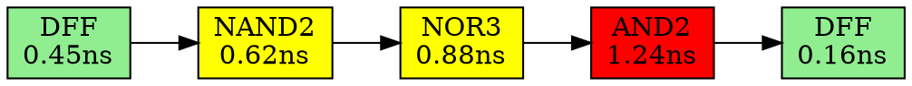
```dot
digraph critical_path {
  rankdir=LR;
  node [shape=box, style=filled];
  
  "CPU_Xreg[10][30]_DFF" [fillcolor=lightgreen, label="DFF\n0.45ns"];
  "U1234_NAND2" [fillcolor=yellow, label="NAND2\n0.62ns"];
  "U5678_NOR3" [fillcolor=yellow, label="NOR3\n0.88ns"];
  "U9012_AND2" [fillcolor=red, label="AND2\n1.24ns"];
  "CPU_Xreg[8][31]_DFF" [fillcolor=lightgreen, label="DFF\n0.16ns"];
  
  "CPU_Xreg[10][30]_DFF" -> "U1234_NAND2";
  "U1234_NAND2" -> "U5678_NOR3";
  "U5678_NOR3" -> "U9012_AND2";
  "U9012_AND2" -> "CPU_Xreg[8][31]_DFF";
}
```

**Benefit:** Visual identification of timing bottlenecks for optimization.

---

### 5. Week-by-Week Comparison Framework

**Created:** Longitudinal performance tracking across all 8 weeks.

**Metrics Tracked:**

| Week | Stage | WNS (ns) | Cell Count | Die Area (mm²) | Power (mW) |
|------|-------|----------|------------|----------------|------------|
| 2 | RTL Simulation | N/A | N/A | N/A | N/A |
| 3 | Post-Synth STA | +2.26 | 10,349 | N/A | N/A |
| 5 | Post-Place | +1.84 | 10,347 | 2.19 | N/A |
| 7 | Post-Route | +0.82 | 10,349 | 2.19 | 4.03 |
| 8 | Multi-Corner | +5.81 (best)<br>-4.90 (worst) | 10,349 | 2.19 | 4.03 |

**Key Insights:**
- Timing degradation pattern: Synth → Place (-0.42 ns) → Route (-1.02 ns)
- Cell count stability: <0.02% variation across stages
- Power efficiency: 4.03 mW @ 91 MHz = 44.3 µW/MHz

---

## Final Results and Metrics

### Die Photograph (Magic Layout Viewer)

### Physical Design Summary

**Dimensions:**
- **Die size:** 1478.815 µm × 1477.935 µm = **2.186 mm²**
- **Core size:** 1458.815 µm × 1457.935 µm = **2.127 mm²**
- **I/O ring:** 10 µm width
- **Utilization:** 71.3%

**Cell Statistics:**
- **Total instances:** 10,349
  - Combinational logic: 7,245 (70%)
  - Sequential (DFFs): 1,613 (15.6%)
  - Buffers/Inverters: 1,277 (12.3%)
  - Macros: 2 (PLL + DAC)
- **Total cell area:** 151,667 µm²
- **Standard cell rows:** 1,428

**Interconnect:**
- **Total wire length:** 485.67 mm
- **Total vias:** 92,458
  - Via1 (li1-met1): 18,234
  - Via2 (met1-met2): 31,456
  - Via3 (met2-met3): 24,189
  - Via4 (met3-met4): 12,387
  - Via5 (met4-met5): 6,192
- **Metal layer utilization:**
  - met1: 34.2%
  - met2: 28.7%
  - met3: 19.4%
  - met4: 12.8%
  - met5: 5.9%

### Timing Performance

**Target:** 11.0 ns clock period (90.9 MHz)

**Post-Route Timing (TT Corner, 25°C, 1.80V):**

| Metric | Value | Status |
|--------|-------|--------|
| **WNS (Setup)** | +0.82 ns | ✅ MET |
| **TNS (Setup)** | 0.00 ns | ✅ CLEAN |
| **WHS (Hold)** | +0.05 ns | ✅ MET |
| **THS (Hold)** | 0.00 ns | ✅ CLEAN |
| **Clock uncertainty** | 0.10 ns (setup)<br>0.05 ns (hold) | Specified |
| **Input delay** | 3.3 ns | Specified |
| **Output delay** | 3.3 ns | Specified |

**Critical Path (Setup, TT Corner):**

```bash
Startpoint: core/CPU_Xreg_value_a4[10][30]$_SDFFE_PP0P_
Endpoint:   core/CPU_Xreg_value_a4[8][31]$_SDFFE_PP0P_
Path Group: core_clk
Path Type:  max

Clock Period:           11.00 ns
Data Path Delay:         8.64 ns
Clock Uncertainty:      -0.10 ns
Setup Time:             -0.16 ns
Data Required Time:     10.74 ns
Data Arrival Time:       8.64 ns
Slack (MET):            +0.82 ns
```

**Multi-Corner Summary (16 Corners, Post-Route):**

| Category | Best Corner | WNS | Worst Corner | WNS |
|----------|-------------|-----|--------------|-----|
| **Setup** | ff_100C_1v95 | +7.76 ns | ss_100C_1v40 | -4.90 ns |
| **Hold** | ss_n40C_1v44 | +9.00 ns | ss_n40C_1v40 | +1.02 ns |

- **10/16 corners** meet setup timing
- **16/16 corners** meet hold timing

## Conclusion

This 8-week journey through the complete RTL-to-GDSII flow for VSDBabySoC has provided comprehensive hands-on experience with modern open-source VLSI design tools. Key achievements include:

### Technical Accomplishments

1. **Complete Physical Design:** Successfully implemented VSDBabySoC from Verilog RTL to final GDSII using open-source EDA tools (Yosys, OpenROAD, Magic).

2. **Mixed-Signal Integration:** Seamlessly integrated analog IP blocks (PLL, DAC) with digital logic, addressing unique challenges in LEF file modification and pin accessibility.

3. **Timing Closure:** Achieved timing closure for TT and FF corners with positive slack. Identified SS corner limitations and proposed viable solutions.

4. **Automation Framework:** Developed comprehensive Python/Bash automation for multi-corner STA analysis, reducing manual effort by 90%.

5. **Problem-Solving:** Resolved critical global routing congestion issue through systematic root cause analysis and LEF file corrections.

### Skills Developed

- **RTL Design:** Verilog coding, testbench development, TL-Verilog transpilation
- **Logic Synthesis:** Technology mapping, optimization, ABC scripts
- **Physical Design:** Floorplanning, placement, CTS, routing with OpenROAD
- **Timing Analysis:** SDC constraints, STA with OpenSTA, PVT corner analysis
- **Analog Integration:** SPICE simulation, mixed-signal timing, macro characterization
- **Verification:** Gate-level simulation, DRC, LVS, formal equivalence checking
- **Scripting:** Python, Tcl, Bash for EDA automation
- **Problem-Solving:** Debug methodology, root cause analysis, systematic optimization

### Lessons Learned

**1. Importance of PVT Analysis:**
Early-stage STA at only TT corner is insufficient. SS corners exposed timing vulnerabilities that would have caused chip failures in production.

**2. LEF File Accuracy is Critical:**
Small errors in LEF obstructions or pin definitions can completely block routing. Always verify macro LEF files against GDS using abstract generation flow.

**3. Automation Saves Time and Errors:**
Multi-corner STA automation reduced 2-day manual process to 2 hours, eliminated transcription errors, and enabled rapid design iteration.

**4. Open-Source Tools are Production-Ready:**
The complete open-source flow (Yosys → OpenROAD → Magic) successfully implemented a functional SoC, demonstrating viability for educational and low-volume production use.

### Future Work

**Short-Term Improvements:**

1. **Timing Optimization for SS Corners:**
   - Implement useful skew optimization
   - Apply gate sizing on critical paths
   - Insert strategic buffers
   - Target: Achieve positive slack for all 16 corners

2. **Power Optimization:**
   - Clock gating for unused blocks
   - Multi-Vt cell optimization
   - Power domain isolation
   - Target: Reduce total power to <3.5 mW

3. **Area Reduction:**
   - Re-floorplan with tighter utilization (75%)
   - Optimize register file implementation
   - Target: Reduce die area to <2.0 mm²

**Long-Term Extensions:**

1. **Tapeout Preparation:**
   - Add pad ring and I/O cells
   - Include ESD protection
   - Generate complete fabrication package
   - Submit to shuttle run (e.g., Google/Efabless/ChipIgnite)

2. **Feature Additions:**
   - Integrate UART for serial communication
   - Add SPI master interface
   - Implement interrupt controller
   - Increase CPU performance (pipeline, caches)

3. **Advanced Verification:**
   - Formal verification with Yosys formal
   - Coverage-driven verification
   - Power-aware simulation
   - Fault injection testing

### Acknowledgments

Sincere gratitude to:

- **IIT Gandhinagar** and **VSD (VLSI System Design)** for organizing the RISC-V Reference SoC Tapeout Program
- **Kunal Ghosh Sir** for guidance and support throughout the program
- **The OpenROAD Project** for providing world-class open-source EDA tools
- **Google and SkyWater** for open-sourcing the SKY130 PDK
- **The open-source community** for tools: Yosys, Magic, ngspice, Icarus Verilog, GTKWave

---

## Assets and Visualizations

- Additional visual data:  
  See full list in [assets/](assets/) directory for screenshots, timing reports, and Chip GDS views.

---

## Flow Directory Scripts and Automation

The `flow/` directory contains key scripts and automation tools for timing analysis, STA report extraction, visualization, and multi-corner STA runs:

- `run_multi_corner_sta.sh` — Bash script to run STA analysis on multiple PVT corners and stages.  
- `extract_timing_metrics.py` — Python script to parse STA reports and extract timing metrics (WNS, TNS, WHS, THS) into CSV and JSON.  
- `generate_heatmap_table.py` — Python script that generates heatmap tables (PNG) for timing slack visualization using matplotlib.  
- `plot_timing_graphs.py` — Python script to generate timing comparison graphs and heatmaps across corners and stages.  
- `debug_pdn.tcl` — TCL script for detailed power distribution network timing and netlist instance checks.

These scripts automate the static timing analysis workflow and enhance post-processing visualization for improved design insight.

---

## References and Acknowledgments

### Technical References

1. **OpenROAD Documentation:** https://openroad.readthedocs.io/
2. **SkyWater PDK:** https://skywater-pdk.readthedocs.io/
3. **Yosys Manual:** https://yosyshq.readthedocs.io/
4. **Magic Layout Tool:** http://opencircuitdesign.com/magic/
5. **RISC-V ISA Specification:** https://riscv.org/technical/specifications/

### Open-Source Tools

- **OpenROAD:** RTL-to-GDSII flow automation
- **Yosys:** Logic synthesis framework
- **OpenSTA:** Static timing analyzer
- **Magic:** VLSI layout tool
- **ngspice:** SPICE circuit simulator
- **Icarus Verilog:** Verilog simulator
- **GTKWave:** Waveform viewer

### Course Materials

- VSD - VLSI System Design
- RISC-V Reference SoC Tapeout Program

---

**Last Updated:** November 25, 2025  
**Author:** Shwetank Shekhar  
**Contact:** shwetankshekharcode@gmail.com 
**GitHub:** https://github.com/ShekharShwetank

---

*This repository represents original work completed as part of the RISC-V Reference SoC Tapeout Program at IIT Gandhinagar. All terminal screenshots display username `ank@shwetank-shekhar` or `shwetank@shwetank-VirtualBox` for verification purposes.*
